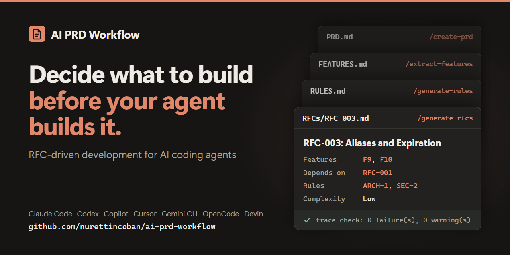
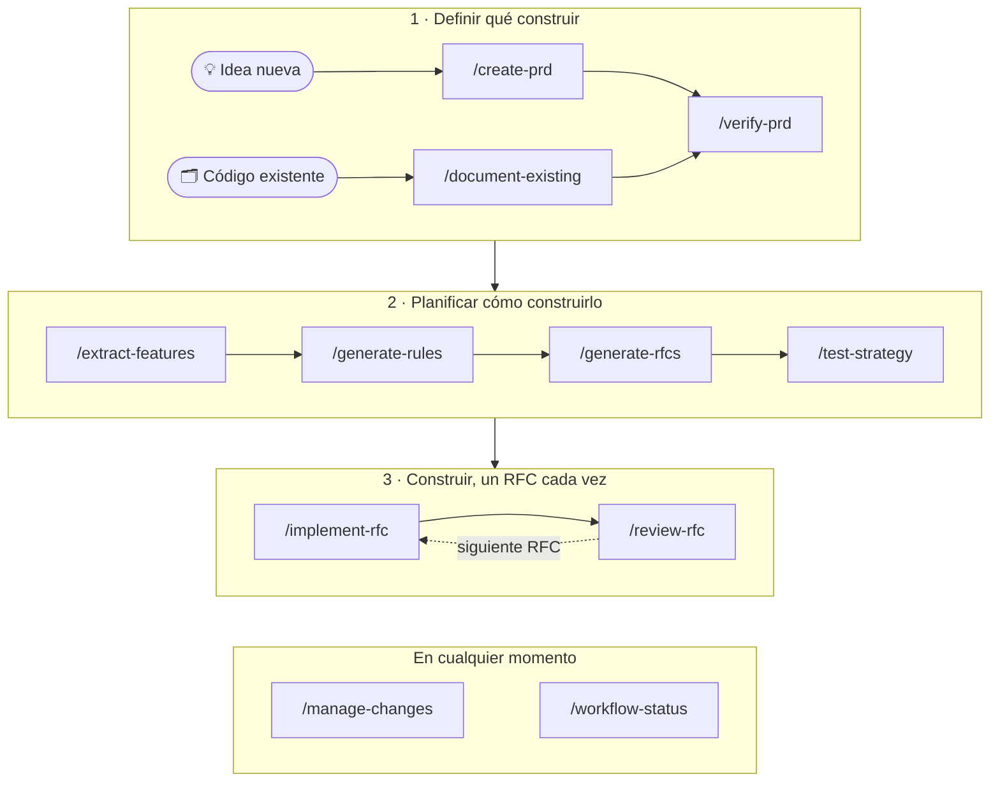

<div align="center">

<a href="https://nurettincoban.github.io/ai-prd-workflow/"></a>

# 📋 AI PRD Workflow

### Desarrollo guiado por RFC para agentes de programación con IA

**Idea o código existente → PRD verificado → funcionalidades → reglas → RFC ordenados → código revisado y probado**

[](https://github.com/nurettincoban/ai-prd-workflow/actions/workflows/ci.yml)
[](LICENSE)
[](https://github.com/nurettincoban/ai-prd-workflow/stargazers)
[](#inicio-rápido)
[](#opciones-de-instalación)

**[🌐 Sitio web](https://nurettincoban.github.io/ai-prd-workflow/)** · **[Inicio rápido](#inicio-rápido)** · **[Cómo funciona](#cómo-funciona)** · **[Por qué](#por-qué-este-flujo-de-trabajo)** · **[Evidencia](#evidencia)** · **[Opciones de instalación](#opciones-de-instalación)**

[English](README.md) · [简体中文](README.zh-CN.md) · [Türkçe](README.tr.md) · [日本語](README.ja.md) · [한국어](README.ko.md) · Español

<sub>Guiado por RFC desde <b>marzo de 2025</b>: antes de que Claude Code o Cursor tuvieran un modo de planificación, y antes de que existieran Kiro o Spec Kit.</sub>

</div>

> [!NOTE]
> Esta traducción puede ir por detrás del README en inglés; si difieren, manda la [versión en inglés](README.md).

---

Los agentes de programación con IA escriben buen código. Se les da peor decidir qué construir, recordar las decisiones de ayer y darse cuenta de que dos documentos se contradicen. Este flujo de trabajo se encarga de esa parte: lleva una idea —o una base de código que ya existe— a un PRD (documento de requisitos de producto) revisado, funcionalidades priorizadas, reglas del proyecto y RFC pequeños en orden de dependencias. Después los implementa y los revisa uno a uno.

Cada paso escribe un archivo markdown que lee el siguiente, así que las decisiones sobreviven a la sesión de chat. Un script comprueba que los archivos siguen siendo coherentes entre sí. Sin CLI que aprender, sin framework que adoptar, sin dependencia de ninguna herramienta.

<p align="center">
  
</p>
<p align="center"><sub>Repetición resumida de una ejecución real de <code>/workflow-status</code> sobre el ejemplo v2.0 del propio repositorio. <a href="examples/url-shortener/workflow-status-on-before.md">Informe completo</a> · <a href="examples/url-shortener/README.md">con qué se comparó</a></sub></p>

## Inicio rápido

**Claude Code**: instala el plugin.

```
/plugin marketplace add nurettincoban/ai-prd-workflow
/plugin install prd-workflow@ai-prd-workflow
```

**Codex, GitHub Copilot, Cursor, Gemini CLI, OpenCode o Devin**: instala las skills en tu proyecto.

```bash
curl -fsSL https://raw.githubusercontent.com/nurettincoban/ai-prd-workflow/main/install.sh | bash -s -- /path/to/your/project
```

**Cualquier asistente de chat** (ChatGPT, Claude.ai, …): copia un prompt de la [tabla de comandos](#cómo-funciona) y pégalo.

> [!IMPORTANT]
> Reinicia tu herramienta de IA después de instalar. Una sesión que ya está en marcha no ve las skills nuevas, así que el primer comando falla con `Unknown skill`: parece una instalación rota, pero solo es una sesión antigua.

Después, ejecuta los comandos en orden:

```
/create-prd          # entrevista → PRD.md   (¿ya hay código? usa /document-existing)
/verify-prd          # huecos y contradicciones → PRD.md mejorado + PRD-REVIEW.md
/extract-features    # → FEATURES.md
/generate-rules      # → RULES.md
/generate-rfcs       # → RFCs/ + RFCS.md, en orden de dependencias
/test-strategy       # → TEST-STRATEGY.md, antes de escribir ninguna prueba
/implement-rfc 001   # plan → tu aprobación → código → prueba de que funciona
/review-rfc 001      # revisión en un contexto nuevo → reviews/REVIEW-RFC-001.md
```

Ejecuta `/workflow-status` cuando no sepas qué viene después, y `/manage-changes` cuando cambien los requisitos. En Codex, escribe `$create-prd` en lugar de `/create-prd`. Con el plugin de Claude Code, los comandos llevan el nombre del plugin: `/prd-workflow:create-prd`.

**Pruébalo primero con el ejemplo.** El ejemplo v2.0 del repositorio parece completo, y no lo está:

```bash
git clone https://github.com/nurettincoban/ai-prd-workflow.git
cd ai-prd-workflow
./install.sh examples/url-shortener/before
```

Abre `examples/url-shortener/before` en tu herramienta de IA, ejecuta `/workflow-status` y compara su informe con [los problemas que encontramos a mano](examples/url-shortener/README.md).

## Cómo funciona



| Comando | Qué hace | Escribe | Prompt |
|---|---|---|---|
| `/create-prd` | Te entrevista sobre la idea, con pocas preguntas cada vez | `PRD.md` | [ver](interactive-prd-creation-prompt.md) |
| `/document-existing` | Lee una base de código existente y luego pregunta lo que el código no puede decirle | `PRD.md`, `FEATURES.md`, `RULES.md` | [ver](document-existing-prompt.md) |
| `/verify-prd` | Encuentra huecos, contradicciones y requisitos que no se pueden construir tal como están escritos | `PRD.md`, `PRD-REVIEW.md` | [ver](prd-comprehensive-verification-prompt.md) |
| `/extract-features` | Convierte los requisitos en funcionalidades con ID permanentes y prioridades MoSCoW | `FEATURES.md` | [ver](prd-to-features-prompt.md) |
| `/generate-rules` | Fija los estándares que el agente debe seguir, con versiones de dependencias comprobadas en el registro | `RULES.md` | [ver](prd-to-rules-prompt.md) |
| `/generate-rfcs` | Divide el trabajo en RFC pequeños en orden de dependencias y luego hace que un lector nuevo revise cada uno en busca de huecos | `RFCs/`, `RFCS.md` | [ver](prd-to-rfcs-prompt.md) |
| `/test-strategy` | Planifica las pruebas de cada RFC antes de escribirlas | `TEST-STRATEGY.md` | [ver](testing-strategy-prompt.md) |
| `/implement-rfc <id>` | Planifica, espera tu aprobación, escribe el código y luego ejecuta la compilación y las pruebas para demostrar cada criterio | código, estado del RFC | [ver](implementation-prompt-template.md) |
| `/review-rfc <id>` | Revisa el código frente al RFC, las reglas y el plan de pruebas, en un contexto nuevo | `reviews/` | [ver](code-review-prompt.md) |
| `/manage-changes` | Contrasta un cambio con las decisiones y reglas anteriores, y después actualiza juntos todos los archivos afectados | `changes/` | [ver](prd-change-management-prompt.md) |
| `/workflow-status` | Informa de lo que está hecho, lo que se ha desviado y qué hacer después | — | [ver](workflow-status-prompt.md) |

Unas pocas reglas lo mantienen todo unido:

- **Planifica, aprueba y después programa.** `/implement-rfc` se detiene tras el plan y espera tu respuesta.
- **Revisa con ojos nuevos.** `/review-rfc` no revisa código escrito en la misma conversación. En Claude Code se ejecuta automáticamente en un contexto aparte.
- **Los ID nunca cambian.** Requisitos, funcionalidades, reglas y RFC se citan entre sí por ID. [`scripts/trace-check.py`](scripts/trace-check.py) falla cuando una cita se rompe o una funcionalidad Must-have no tiene RFC, y los comandos lo ejecutan por ti.
- **Cuando los archivos no coinciden,** `PRD.md` prevalece sobre `FEATURES.md`, este sobre `RULES.md` y, por último, sobre los RFC. Los comandos indican qué archivo siguieron y marcan el otro para corregirlo.

## Por qué este flujo de trabajo

Tu agente de programación probablemente tenga un modo de planificación. Un modo de planificación planifica una tarea. Este flujo de trabajo planifica el producto:

| Modo de planificación integrado | Este flujo de trabajo |
|---|---|
| Planifica una tarea: «¿cómo construyo esto?» | Planifica el producto: qué construimos, para quién y qué queda fuera del alcance |
| El plan desaparece con la sesión | El PRD, las funcionalidades, las reglas y los RFC permanecen: entre sesiones, modelos, herramientas y compañeros de equipo |
| Toma tu petición al pie de la letra | Primero te entrevista, para que las decisiones queden por escrito antes de que exista código |
| Revisa el código según «parece correcto» | Revisa frente a criterios de aceptación escritos y contrasta los archivos entre sí |

Ambos se complementan: `/generate-rfcs` decide cuál es la siguiente pieza de trabajo y `/implement-rfc` le entrega al planificador de tu agente una tarea pequeña y bien definida.

**Úsalo para** proyectos de varias semanas y cualquier cosa seria que construyas con IA, donde el crecimiento descontrolado del alcance y las decisiones olvidadas hacen más daño que la calidad del código. **No hace falta para** un arreglo de una línea.

Si conoces el desarrollo guiado por especificaciones (spec-driven development: GitHub Spec Kit, Amazon Kiro), esta es la misma idea, con los RFC como unidad de trabajo y sin CLI ni framework que adoptar. Y es anterior a ambos.

## Evidencia

Cada paso mira el proyecto desde un ángulo distinto, y cada uno detecta problemas que los demás no pueden ver. Se midió construyendo de principio a fin, con este flujo de trabajo y a partir de un PRD real, una biblioteca de TypeScript real:

| Paso | Qué detectó | Por qué solo este paso lo detectó |
|---|---|---|
| `/verify-prd` | Una función que contradecía la propia convención del PRD; un espacio de color sin especificar; una dependencia de renderizado oculta | Comparó la especificación con la implementación de referencia |
| Casos límite del RFC | Que la versión fijada de TypeScript rompería la compilación; un error de aliasing al clonar | Razonó sobre código que todavía no existía |
| `/review-rfc` | Una fuga de geometría en una ruta de error; entradas `NaN` sin validar | Los 17 criterios de aceptación ya se cumplían |
| `/test-strategy` | Nunca se comprobó que las normales fueran finitas, así que la geometría degenerada se renderizaba en negro mientras todas las pruebas pasaban | Pregunta qué pruebas deberían existir, no cuáles existen |
| `/workflow-status` | Dos archivos obligatorios que nunca se crearon, mientras su RFC figuraba como terminado | Contrastó lo afirmado con los archivos del disco |
| CI a partir de un RFC | Un rango de peer dependency incorrecto: las pruebas fallaban en tres versiones publicadas | Ejecutó las pruebas contra cada versión |
| Revisión de un lector nuevo | Un RFC que se contradecía; un criterio que solo podía cumplirse por suerte | El autor los había pasado por alto una y otra vez |

El resultado más llamativo: antes de que existiera una sola línea de código, la sección de casos límite de un RFC predijo que un plugin de compilación aún no admitiría TypeScript 7, e indicó la versión a la que volver. Fue exactamente lo que pasó. La comprobación de tipos pasó en todo momento, así que solo ejecutar la compilación lo reveló.

Los ID también se mantuvieron. Cuando el PRD cambió a mitad del proyecto, un agente nuevo volvió a ejecutar `/extract-features` y añadió las funcionalidades nuevas al final en lugar de renumerar, sin que nadie se lo pidiera, porque los RFC citaban las funcionalidades por número.

Esa biblioteca no forma parte de este repositorio, así que aquí tienes evidencia que puedes comprobar tú mismo:

- **[El ejemplo url-shortener](examples/url-shortener/)**: ejecuciones en un contexto nuevo, que nunca vieron nuestra lista de problemas conocidos, encontraron 12 de 13 problemas entre documentos (`/workflow-status`) y 10 de 10 problemas del PRD (`/verify-prd`), además de varios que se nos habían escapado.
- **[La batería de evaluaciones](evals/)**: ejecuta las mismas comprobaciones con y sin el flujo de trabajo, para que la diferencia se mida en lugar de afirmarse.

## Opciones de instalación

`install.sh` coloca las skills donde cada herramienta las busca:

| Herramienta | Carpeta | Ejecutar un comando |
|---|---|---|
| Claude Code | `.claude/skills/` o el plugin | `/create-prd` |
| GitHub Copilot (VS Code, CLI) | `.agents/skills/` | `/create-prd` |
| Cursor | `.agents/skills/` | `/create-prd`, desde el menú `/` |
| Gemini CLI | `.agents/skills/` | `/create-prd` |
| OpenCode | `.agents/skills/` | `/create-prd` |
| Devin | `.agents/skills/` | `/create-prd` |
| Codex | `.agents/skills/` | `$create-prd`, o elígelo en `/skills` |

Desde un clon de este repositorio:

```bash
./install.sh /path/to/your/project            # ambas carpetas (por defecto)
./install.sh /path/to/your/project --claude   # solo Claude Code
./install.sh /path/to/your/project --agents   # solo las demás herramientas
```

- `install.sh` nunca sobrescribe una skill que hayas editado. `--force` la reemplaza tras guardar una copia de seguridad.
- `--ref v3.0.0` instala una versión concreta. Usa la misma etiqueta en la URL de curl.
- ¿Actualizas desde la v2? Añade `--remove-legacy` para mover los archivos de comandos antiguos a una carpeta de copia de seguridad.
- ¿Prefieres copiar y pegar? `./copy-prompt.sh --list` muestra los prompts y `./copy-prompt.sh <file>` copia uno al portapapeles.

## Consejos

- **Responde a las preguntas.** Los comandos de entrevista funcionan mejor con tus decisiones reales que con las suposiciones del agente.
- **Lee cada archivo antes de seguir.** Corregir un PRD lleva minutos; corregir código construido sobre un PRD equivocado lleva días.
- **Mantén las reglas en el contexto.** Referencia `RULES.md` desde la configuración de tu agente (`CLAUDE.md`, `AGENTS.md` o `.cursor/rules/`). `/generate-rules` sugiere cómo.
- **Trabaja en paralelo si puedes.** Un RFC puede empezar en cuanto terminan sus predecesores declarados. Si trabajas solo, basta con seguir los números.

## Contribuir

Consulta [CONTRIBUTING.md](CONTRIBUTING.md). Los archivos de prompts de la raíz son la fuente; todo lo demás se genera a partir de ellos o se comprueba contra ellos.

## Agradecimientos

Gracias a [Anthropic](https://www.anthropic.com) por apoyar este proyecto y darle la bienvenida en su programa de código abierto.

## Licencia

MIT: consulta [LICENSE](LICENSE).

---

<p align="center">Si este flujo de trabajo te ahorra tiempo, una ⭐ ayuda a que otros lo encuentren.</p>
