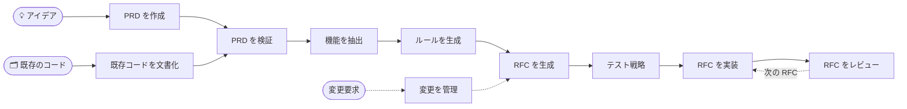

<div align="center">

# 📋 AI PRD Workflow

### AI コーディングエージェントのための RFC 駆動開発

**アイデアまたは既存のコード → 検証済みの PRD → 機能 → ルール → 順序付きの RFC → レビューとテストを経たコード**

[](https://github.com/nurettincoban/ai-prd-workflow/actions/workflows/ci.yml)
[](LICENSE)
[](https://github.com/nurettincoban/ai-prd-workflow/stargazers)
[](#クイックスタート)
[](#インストールオプション)

**[クイックスタート](#クイックスタート)** · **[仕組み](#仕組み)** · **[なぜ](#なぜこのワークフローか)** · **[実証](#実証)** · **[インストールオプション](#インストールオプション)**

[English](README.md) · [简体中文](README.zh-CN.md) · [Türkçe](README.tr.md) · 日本語 · [한국어](README.ko.md) · [Español](README.es.md)

<sub><b>2025 年 3 月</b>から RFC 駆動 —— Claude Code や Cursor にプランモードが登場する前、そして Kiro や Spec Kit が生まれる前から。</sub>

</div>

> [!NOTE]
> この翻訳は英語版 README より更新が遅れる場合があります。内容が異なる場合は[英語版](README.md)が正となります。

---

AI コーディングエージェントはコードを書くのが得意です。苦手なのは、何を作るべきかを決めること、昨日の決定を覚えておくこと、そして 2 つのドキュメントが食い違っていることに気づくことです。このワークフローはその部分を担います。アイデア（あるいはすでに存在するコードベース）を、レビュー済みの PRD（製品要求仕様書）、優先度付きの機能一覧、プロジェクトのルール、そして依存関係の順に並んだ小さな RFC へと変換し、それらを 1 つずつ実装・レビューします。

各ステップは次のステップが読む markdown ファイルを書き出すので、チャットセッションが終わっても決定は失われません。さらにスクリプトが、ファイル同士の整合性が保たれているかをチェックします。覚えるべき CLI も、導入すべきフレームワークも、ロックインもありません。

<p align="center">
  
</p>
<p align="center"><sub>このリポジトリ自身の v2.0 サンプルに対する実際の <code>/workflow-status</code> の実行結果を、要約して再生したものです。<a href="examples/url-shortener/workflow-status-on-before.md">完全なレポート</a> · <a href="examples/url-shortener/README.md">照合に使った問題リスト</a></sub></p>

## クイックスタート

**Claude Code** — プラグインをインストールします:

```
/plugin marketplace add nurettincoban/ai-prd-workflow
/plugin install prd-workflow@ai-prd-workflow
```

**Codex、GitHub Copilot、Cursor、Gemini CLI、OpenCode、Devin** — スキルをプロジェクトにインストールします:

```bash
curl -fsSL https://raw.githubusercontent.com/nurettincoban/ai-prd-workflow/main/install.sh | bash -s -- /path/to/your/project
```

**任意のチャットアシスタント**（ChatGPT、Claude.ai など） — [コマンド表](#仕組み)からプロンプトをコピーして貼り付けます。

> [!IMPORTANT]
> インストール後は AI ツールを再起動してください。実行中のセッションは新しいスキルを認識しないため、最初のコマンドが `Unknown skill` で失敗します。インストールが壊れているように見えますが、セッションが古いだけです。

その後、コマンドを順番に実行します:

```
/create-prd          # インタビュー → PRD.md（既存のコードがある場合は /document-existing）
/verify-prd          # 抜けと矛盾 → 改善された PRD.md + PRD-REVIEW.md
/extract-features    # → FEATURES.md
/generate-rules      # → RULES.md
/generate-rfcs       # → RFCs/ + RFCS.md（依存関係の順）
/test-strategy       # → TEST-STRATEGY.md（テストを書く前に）
/implement-rfc 001   # 計画 → あなたの承認 → コード → 動作の証明
/review-rfc 001      # 新しいコンテキストでレビュー → reviews/REVIEW-RFC-001.md
```

次に何をすべきか迷ったら `/workflow-status` を、要件が変わったら `/manage-changes` を実行してください。Codex では `/create-prd` の代わりに `$create-prd` と入力します。Claude Code プラグインでは、コマンドにプラグイン名が付きます: `/prd-workflow:create-prd`。

**まずはサンプルで試してみましょう。** リポジトリにある v2.0 のサンプルは完成しているように見えますが、そうではありません:

```bash
git clone https://github.com/nurettincoban/ai-prd-workflow.git
cd ai-prd-workflow
./install.sh examples/url-shortener/before
```

AI ツールで `examples/url-shortener/before` を開き、`/workflow-status` を実行して、そのレポートを[私たちが手作業で見つけた問題](examples/url-shortener/README.md)と比べてみてください。

## 仕組み



| コマンド | 内容 | 書き出すもの | プロンプト |
|---|---|---|---|
| `/create-prd` | アイデアについて、一度に数問ずつインタビューする | `PRD.md` | [表示](interactive-prd-creation-prompt.md) |
| `/document-existing` | 既存のコードベースを読み、コードからは分からないことを質問する | `PRD.md`、`FEATURES.md`、`RULES.md` | [表示](document-existing-prompt.md) |
| `/verify-prd` | 抜け、矛盾、書かれたとおりには実装できない要求を見つける | `PRD.md`、`PRD-REVIEW.md` | [表示](prd-comprehensive-verification-prompt.md) |
| `/extract-features` | 要求を、永続的な ID と MoSCoW の優先度を持つ機能に変換する | `FEATURES.md` | [表示](prd-to-features-prompt.md) |
| `/generate-rules` | エージェントが従うべき標準を定める。依存関係のバージョンはレジストリで確認する | `RULES.md` | [表示](prd-to-rules-prompt.md) |
| `/generate-rfcs` | 作業を依存関係順の小さな RFC に分割し、「初見の読み手」に 1 つずつ抜けを確認させる | `RFCs/`、`RFCS.md` | [表示](prd-to-rfcs-prompt.md) |
| `/test-strategy` | テストを書く前に、RFC ごとのテストを計画する | `TEST-STRATEGY.md` | [表示](testing-strategy-prompt.md) |
| `/implement-rfc <id>` | 計画を立てて承認を待ち、コードを書き、ビルドとテストを実行して各受け入れ基準を証明する | コード、RFC のステータス | [表示](implementation-prompt-template.md) |
| `/review-rfc <id>` | 新しいコンテキストで、RFC・ルール・テスト計画に照らしてコードをレビューする | `reviews/` | [表示](code-review-prompt.md) |
| `/manage-changes` | 変更を過去の決定やルールと照合し、影響を受けるファイルをまとめて更新する | `changes/` | [表示](prd-change-management-prompt.md) |
| `/workflow-status` | 完了したこと、ずれが生じたこと、次にやるべきことを報告する | — | [表示](workflow-status-prompt.md) |

ワークフローを支えるいくつかのルール:

- **計画し、承認し、それからコードを書く。** `/implement-rfc` は計画を示したあと止まり、あなたを待ちます。
- **新鮮な目でレビューする。** `/review-rfc` は同じ会話の中で書かれたコードをレビューしません。Claude Code では自動的に別のコンテキストで実行されます。
- **ID は決して変わらない。** 要求・機能・ルール・RFC は互いを ID で参照します。参照が切れたり、Must-have の機能に RFC がなかったりすると [`scripts/trace-check.py`](scripts/trace-check.py) が失敗します。各コマンドがこれを自動で実行します。
- **ファイル同士が食い違うときは、** `PRD.md` が `FEATURES.md` より優先され、その次が `RULES.md`、最後が RFC です。コマンドはどのファイルに従ったかを明示し、もう一方を修正対象として指摘します。

## なぜこのワークフローか

お使いのコーディングエージェントには、おそらくプランモードがあるでしょう。プランモードが計画するのは 1 つのタスクです。このワークフローが計画するのはプロダクトです:

| 組み込みのプランモード | このワークフロー |
|---|---|
| 1 つのタスクを計画する:「これをどう作るか？」 | プロダクトを計画する: 何を、誰のために作り、何をスコープ外とするか？ |
| 計画はセッションとともに消える | PRD、機能、ルール、RFC は残り続ける —— セッション、モデル、ツール、チームメンバーをまたいで |
| リクエストを額面どおりに受け取る | まずインタビューを行い、コードが存在する前に決定を書き残す |
| 「良さそうに見えるか」でコードをレビューする | 書かれた受け入れ基準に照らしてレビューし、ファイル同士を突き合わせる |

両者は補い合います: `/generate-rfcs` が次の作業単位を決め、`/implement-rfc` がエージェントのプランナーに小さく明確なタスクを渡します。

**向いているのは、** 数週間にわたる開発や、AI で本気で作るあらゆるもの —— コードの品質よりも、スコープの肥大化や忘れられた決定のほうが痛手になる場面です。**向いていないのは、** 1 行の修正です。

仕様駆動開発（spec-driven development。GitHub Spec Kit や Amazon Kiro など）をご存じなら、これは同じ考え方です。作業単位は RFC で、導入すべき CLI やフレームワークはありません。そして、そのどちらよりも先に生まれました。

## 実証

各ステップはプロジェクトを異なる角度から見て、他のステップでは見つけられない問題を見つけます。これは、実際の PRD からこのワークフローで実際の TypeScript ライブラリをエンドツーエンドで構築して測定したものです:

| ステップ | 見つけたもの | なぜこのステップだけが見つけられたか |
|---|---|---|
| `/verify-prd` | PRD 自身の規約に反する関数、指定されていない色空間、隠れたレンダリング依存 | 仕様をリファレンス実装と比較した |
| RFC のエッジケース | 固定した TypeScript のバージョンがビルドを壊すこと、クローンのエイリアシングのバグ | まだ存在しないコードについて推論した |
| `/review-rfc` | エラーパスでのジオメトリのリーク、検証されていない `NaN` 入力 | 17 個の受け入れ基準はすでにすべて通っていた |
| `/test-strategy` | 法線が有限値かどうか一度もチェックされておらず、退化したジオメトリが黒く描画されていたのに、テストはすべて通っていた | いまあるテストではなく、あるべきテストを問う |
| `/workflow-status` | RFC は完了と報告されていたのに、必須ファイルが 2 つ作られていなかった | 主張をディスク上のファイルと照合した |
| RFC から作られた CI | peer 依存関係の範囲が誤っていた: 公開済みの 3 つのバージョンでテストが失敗した | バージョンごとに実際にテストを実行した |
| 初見の読み手によるチェック | 自己矛盾した RFC、運が良くないと通らない受け入れ基準 | 書き手は何度読んでも見落としていた |

最も印象的な結果: コードが 1 行も存在しない段階で、ある RFC のエッジケースの節が、ビルドプラグインがまだ TypeScript 7 に対応していないことを予測し、代替のバージョンまで明記していました。実際にそのとおりになりました。型チェックは最後まで通っていたので、問題が明らかになったのはビルドを実際に実行したときだけでした。

ID も保たれました。プロジェクトの途中で PRD が変わったとき、新しいエージェントが `/extract-features` を再実行し、番号を振り直す代わりに新しい機能を末尾に追加しました —— 誰にも指示されずに。RFC が機能を番号で参照していたからです。

そのライブラリはこのリポジトリには含まれていないので、ご自身で確認できる証拠を挙げます:

- **[url-shortener のサンプル](examples/url-shortener/)** —— 私たちの既知の問題リストを一度も見ていない新しいコンテキストでの実行が、ドキュメント間の問題 13 件中 12 件（`/workflow-status`）と、PRD の問題 10 件中 10 件（`/verify-prd`）を見つけ、さらに私たちが見落としていた問題もいくつか見つけました。
- **[評価スイート](evals/)** —— 同じチェックをワークフローありとなしの両方で実行し、差を主張ではなく測定で示します。

## インストールオプション

`install.sh` は、各ツールがスキルを探す場所にスキルを配置します:

| ツール | フォルダ | コマンドの実行 |
|---|---|---|
| Claude Code | `.claude/skills/`、またはプラグイン | `/create-prd` |
| GitHub Copilot（VS Code、CLI） | `.agents/skills/` | `/create-prd` |
| Cursor | `.agents/skills/` | `/create-prd`（`/` メニューから） |
| Gemini CLI | `.agents/skills/` | `/create-prd` |
| OpenCode | `.agents/skills/` | `/create-prd` |
| Devin | `.agents/skills/` | `/create-prd` |
| Codex | `.agents/skills/` | `$create-prd`、または `/skills` から選択 |

このリポジトリのクローンから:

```bash
./install.sh /path/to/your/project            # 両方のフォルダ（デフォルト）
./install.sh /path/to/your/project --claude   # Claude Code のみ
./install.sh /path/to/your/project --agents   # その他のツールのみ
```

- `install.sh` は、あなたが編集したスキルを決して上書きしません。`--force` はバックアップを保存してから置き換えます。
- `--ref v3.0.0` で特定のリリースをインストールできます。curl の URL にも同じタグを使ってください。
- v2 からアップグレードしますか？ `--remove-legacy` を付けると、古いコマンドファイルがバックアップフォルダに移動されます。
- コピー＆ペーストのほうが好みですか？ `./copy-prompt.sh --list` でプロンプトの一覧を表示し、`./copy-prompt.sh <file>` で 1 つをクリップボードにコピーできます。

## ヒント

- **質問には答えましょう。** インタビュー型のコマンドは、エージェントの推測ではなく、あなたの実際の決定があるときに最もよく機能します。
- **次に進む前に各ファイルを読みましょう。** PRD の修正は数分で済みますが、誤った PRD の上に書かれたコードの修正には数日かかります。
- **ルールをコンテキストに置いておきましょう。** エージェントの設定（`CLAUDE.md`、`AGENTS.md`、`.cursor/rules/`）から `RULES.md` を参照してください。方法は `/generate-rules` が提案します。
- **可能なら並行して進めましょう。** RFC は、宣言された前提 RFC が完了すればすぐに着手できます。1 人で作業するなら、番号順に進めれば十分です。

## コントリビュート

[CONTRIBUTING.md](CONTRIBUTING.md) をご覧ください。ルートにあるプロンプトファイルが唯一の情報源で、それ以外はすべてそこから生成されるか、それに基づいてチェックされます。

## 謝辞

このプロジェクトを支援し、オープンソースプログラムに迎え入れてくださった [Anthropic](https://www.anthropic.com) に感謝します。

## ライセンス

MIT —— [LICENSE](LICENSE) をご覧ください。

---

<p align="center">このワークフローで時間を節約できたら、⭐ を付けていただけると、より多くの人に届きます。</p>
