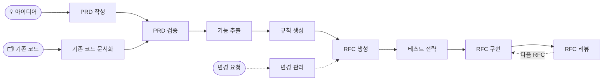

<div align="center">

# 📋 AI PRD Workflow

### AI 코딩 에이전트를 위한 RFC 주도 개발

**아이디어 또는 기존 코드 → 검증된 PRD → 기능 → 규칙 → 순서가 정해진 RFC → 리뷰와 테스트를 거친 코드**

[](https://github.com/nurettincoban/ai-prd-workflow/actions/workflows/ci.yml)
[](LICENSE)
[](https://github.com/nurettincoban/ai-prd-workflow/stargazers)
[](#빠른-시작)
[](#설치-옵션)

**[빠른 시작](#빠른-시작)** · **[작동 방식](#작동-방식)** · **[왜](#왜-이-워크플로인가)** · **[근거](#근거)** · **[설치 옵션](#설치-옵션)**

[English](README.md) · [简体中文](README.zh-CN.md) · [Türkçe](README.tr.md) · [日本語](README.ja.md) · 한국어 · [Español](README.es.md)

<sub><b>2025년 3월</b>부터 RFC 주도 —— Claude Code나 Cursor에 플랜 모드가 생기기 전, Kiro나 Spec Kit이 나오기 전부터.</sub>

</div>

> [!NOTE]
> 이 번역은 영어 README보다 늦게 갱신될 수 있습니다. 내용이 다르면 [영어판](README.md)을 기준으로 합니다.

---

AI 코딩 에이전트는 코드를 잘 작성합니다. 하지만 무엇을 만들지 정하고, 어제 내린 결정을 기억하고, 두 문서가 서로 어긋난다는 사실을 알아차리는 데는 서툽니다. 이 워크플로는 바로 그 부분을 맡습니다. 아이디어(또는 이미 존재하는 코드베이스)를 리뷰를 거친 PRD(제품 요구사항 문서), 우선순위가 매겨진 기능, 프로젝트 규칙, 그리고 의존 관계 순서로 정렬된 작은 RFC로 바꾼 다음, 하나씩 구현하고 리뷰합니다.

모든 단계는 다음 단계가 읽을 markdown 파일을 남기므로, 채팅 세션이 끝나도 결정이 사라지지 않습니다. 또한 스크립트가 파일들이 여전히 서로 일치하는지 확인합니다. 배워야 할 CLI도, 도입해야 할 프레임워크도, 특정 도구에 대한 종속도 없습니다.

<p align="center">
  
</p>
<p align="center"><sub>이 저장소에 포함된 v2.0 예제에 대해 실제로 <code>/workflow-status</code>를 실행한 결과를 요약해 재생한 것입니다. <a href="examples/url-shortener/workflow-status-on-before.md">전체 보고서</a> · <a href="examples/url-shortener/README.md">대조에 사용한 문제 목록</a></sub></p>

## 빠른 시작

**Claude Code** — 플러그인을 설치합니다:

```
/plugin marketplace add nurettincoban/ai-prd-workflow
/plugin install prd-workflow@ai-prd-workflow
```

**Codex, GitHub Copilot, Cursor, Gemini CLI, OpenCode, Devin** — 스킬을 프로젝트에 설치합니다:

```bash
curl -fsSL https://raw.githubusercontent.com/nurettincoban/ai-prd-workflow/main/install.sh | bash -s -- /path/to/your/project
```

**모든 채팅 어시스턴트**(ChatGPT, Claude.ai 등) — [명령어 표](#작동-방식)에서 프롬프트를 복사해 붙여넣으세요.

> [!IMPORTANT]
> 설치한 뒤에는 AI 도구를 재시작하세요. 실행 중인 세션은 새 스킬을 인식하지 못해서 첫 명령이 `Unknown skill`로 실패합니다. 설치가 잘못된 것처럼 보이지만, 세션이 오래되었을 뿐입니다.

그다음 명령어를 순서대로 실행합니다:

```
/create-prd          # 인터뷰 → PRD.md   (기존 코드가 있다면 대신 /document-existing)
/verify-prd          # 빠진 부분과 모순 → 개선된 PRD.md + PRD-REVIEW.md
/extract-features    # → FEATURES.md
/generate-rules      # → RULES.md
/generate-rfcs       # → RFCs/ + RFCS.md, 의존 관계 순서대로
/test-strategy       # → TEST-STRATEGY.md, 테스트를 작성하기 전에
/implement-rfc 001   # 계획 → 사용자 승인 → 코드 → 동작한다는 증거
/review-rfc 001      # 새 컨텍스트에서 리뷰 → reviews/REVIEW-RFC-001.md
```

다음에 무엇을 해야 할지 모르겠다면 `/workflow-status`를, 요구사항이 바뀌면 `/manage-changes`를 실행하세요. Codex에서는 `/create-prd` 대신 `$create-prd`를 입력합니다. Claude Code 플러그인에서는 명령어 앞에 플러그인 이름이 붙습니다: `/prd-workflow:create-prd`.

**먼저 예제로 시험해 보세요.** 저장소의 v2.0 예제는 완성된 것처럼 보이지만, 그렇지 않습니다:

```bash
git clone https://github.com/nurettincoban/ai-prd-workflow.git
cd ai-prd-workflow
./install.sh examples/url-shortener/before
```

AI 도구에서 `examples/url-shortener/before`를 열고 `/workflow-status`를 실행한 뒤, 그 보고서를 [우리가 직접 찾은 문제들](examples/url-shortener/README.md)과 비교해 보세요.

## 작동 방식



| 명령어 | 하는 일 | 작성하는 파일 | 프롬프트 |
|---|---|---|---|
| `/create-prd` | 아이디어에 대해 한 번에 몇 가지씩 질문하며 인터뷰합니다 | `PRD.md` | [보기](interactive-prd-creation-prompt.md) |
| `/document-existing` | 기존 코드베이스를 읽은 뒤, 코드만으로는 알 수 없는 것을 묻습니다 | `PRD.md`, `FEATURES.md`, `RULES.md` | [보기](document-existing-prompt.md) |
| `/verify-prd` | 빠진 부분, 모순, 쓰인 그대로는 구현할 수 없는 요구사항을 찾습니다 | `PRD.md`, `PRD-REVIEW.md` | [보기](prd-comprehensive-verification-prompt.md) |
| `/extract-features` | 요구사항을 영구 ID와 MoSCoW 우선순위를 가진 기능으로 바꿉니다 | `FEATURES.md` | [보기](prd-to-features-prompt.md) |
| `/generate-rules` | 에이전트가 따라야 할 표준을 정하고, 의존성 버전은 레지스트리에서 확인합니다 | `RULES.md` | [보기](prd-to-rules-prompt.md) |
| `/generate-rfcs` | 작업을 의존 관계 순서의 작은 RFC로 나눈 뒤, '처음 읽는 사람'에게 하나씩 빠진 부분을 점검하게 합니다 | `RFCs/`, `RFCS.md` | [보기](prd-to-rfcs-prompt.md) |
| `/test-strategy` | 테스트를 작성하기 전에 RFC별 테스트를 계획합니다 | `TEST-STRATEGY.md` | [보기](testing-strategy-prompt.md) |
| `/implement-rfc <id>` | 계획을 세우고 승인을 기다린 뒤 코드를 작성하고, 빌드와 테스트를 실행해 각 인수 기준을 증명합니다 | 코드, RFC 상태 | [보기](implementation-prompt-template.md) |
| `/review-rfc <id>` | 새 컨텍스트에서 RFC, 규칙, 테스트 계획에 비추어 코드를 리뷰합니다 | `reviews/` | [보기](code-review-prompt.md) |
| `/manage-changes` | 변경 사항을 과거의 결정과 규칙에 비추어 확인한 뒤, 영향받는 모든 파일을 함께 갱신합니다 | `changes/` | [보기](prd-change-management-prompt.md) |
| `/workflow-status` | 무엇이 끝났고, 무엇이 어긋났으며, 다음에 무엇을 할지 보고합니다 | — | [보기](workflow-status-prompt.md) |

워크플로를 지탱하는 몇 가지 규칙:

- **계획하고, 승인받고, 그다음에 코딩한다.** `/implement-rfc`는 계획을 제시한 뒤 멈추고 사용자를 기다립니다.
- **새로운 눈으로 리뷰한다.** `/review-rfc`는 같은 대화에서 작성된 코드는 리뷰하지 않습니다. Claude Code에서는 자동으로 별도의 컨텍스트에서 실행됩니다.
- **ID는 절대 바뀌지 않는다.** 요구사항, 기능, 규칙, RFC는 ID로 서로를 참조합니다. 참조가 끊기거나 Must-have 기능에 RFC가 없으면 [`scripts/trace-check.py`](scripts/trace-check.py)가 실패하며, 각 명령어가 이를 자동으로 실행합니다.
- **파일끼리 어긋날 때는** `PRD.md`가 `FEATURES.md`보다 우선하고, 그다음이 `RULES.md`, 마지막이 RFC입니다. 명령어는 어떤 파일을 따랐는지 밝히고, 다른 파일을 수정 대상으로 표시합니다.

## 왜 이 워크플로인가

사용하는 코딩 에이전트에는 아마 플랜 모드가 있을 것입니다. 플랜 모드는 하나의 작업을 계획합니다. 이 워크플로는 제품을 계획합니다:

| 내장 플랜 모드 | 이 워크플로 |
|---|---|
| 하나의 작업을 계획한다: "이걸 어떻게 만들지?" | 제품을 계획한다: 무엇을, 누구를 위해 만들고, 무엇을 범위에서 제외할지? |
| 계획은 세션과 함께 사라진다 | PRD, 기능, 규칙, RFC가 남는다 —— 세션, 모델, 도구, 팀원을 넘어서 |
| 요청을 있는 그대로 받아들인다 | 먼저 인터뷰를 해서, 코드가 생기기 전에 결정을 기록으로 남긴다 |
| "괜찮아 보이는지"로 코드를 리뷰한다 | 문서화된 인수 기준에 비추어 리뷰하고, 파일끼리 대조한다 |

둘은 함께 작동합니다: `/generate-rfcs`가 다음 작업 단위를 정하고, `/implement-rfc`가 에이전트의 플래너에게 작고 명확한 작업을 넘깁니다.

**이럴 때 쓰세요:** 몇 주에 걸친 개발, 그리고 AI로 진지하게 만드는 모든 것 —— 코드 품질보다 범위가 불어나는 것과 잊힌 결정이 더 큰 타격이 되는 경우입니다. **이럴 때는 필요 없습니다:** 한 줄짜리 수정.

스펙 주도 개발(spec-driven development. GitHub Spec Kit, Amazon Kiro 등)을 알고 있다면, 같은 아이디어입니다. 작업 단위는 RFC이고, 도입해야 할 CLI나 프레임워크가 없습니다. 그리고 둘보다 먼저 나왔습니다.

## 근거

각 단계는 프로젝트를 서로 다른 각도에서 보고, 다른 단계가 찾지 못하는 문제를 찾아냅니다. 이는 실제 PRD에서 출발해 이 워크플로로 실제 TypeScript 라이브러리를 처음부터 끝까지 만들면서 측정한 것입니다:

| 단계 | 무엇을 잡아냈나 | 왜 이 단계만 잡아낼 수 있었나 |
|---|---|---|
| `/verify-prd` | PRD 자신의 규칙에 어긋나는 함수, 지정되지 않은 색 공간, 숨겨진 렌더링 의존성 | 명세를 레퍼런스 구현과 비교했다 |
| RFC의 엣지 케이스 | 고정한 TypeScript 버전이 빌드를 깨뜨린다는 것, 클론 앨리어싱 버그 | 아직 존재하지 않는 코드에 대해 추론했다 |
| `/review-rfc` | 에러 경로에서의 지오메트리 누수, 검증되지 않은 `NaN` 입력 | 17개의 인수 기준은 이미 모두 통과한 상태였다 |
| `/test-strategy` | 법선이 유한한지 한 번도 확인하지 않아 퇴화한 지오메트리가 검게 렌더링되었지만, 테스트는 모두 통과했다 | 지금 있는 테스트가 아니라 있어야 할 테스트를 묻는다 |
| `/workflow-status` | RFC는 완료로 보고되었는데, 필수 파일 두 개가 만들어지지 않았다 | 주장을 디스크의 파일과 대조했다 |
| RFC에서 나온 CI | peer 의존성 범위가 잘못되어 있었다: 배포된 세 버전에서 테스트가 실패했다 | 버전마다 테스트를 실제로 실행했다 |
| 처음 읽는 사람의 점검 | 스스로 모순되는 RFC, 운이 좋아야만 통과하는 인수 기준 | 작성자는 여러 번 읽고도 놓쳤다 |

가장 인상적인 결과: 코드가 하나도 없던 시점에, 한 RFC의 엣지 케이스 절이 빌드 플러그인이 아직 TypeScript 7을 지원하지 않으리라는 것을 예측하고 대체 버전까지 적어 두었습니다. 실제로 그대로 일어났습니다. 타입 검사는 내내 통과했기 때문에, 문제는 빌드를 실제로 실행했을 때에만 드러났습니다.

ID도 지켜졌습니다. 프로젝트 도중에 PRD가 바뀌었을 때, 새 에이전트가 `/extract-features`를 다시 실행했고, 번호를 다시 매기는 대신 새 기능을 끝에 추가했습니다 —— 아무도 시키지 않았는데도요. RFC가 기능을 번호로 참조하고 있었기 때문입니다.

그 라이브러리는 이 저장소에 포함되어 있지 않으므로, 직접 확인할 수 있는 근거를 소개합니다:

- **[url-shortener 예제](examples/url-shortener/)** —— 우리가 정리한 알려진 문제 목록을 한 번도 보지 않은 새 컨텍스트에서의 실행이, 문서 간 문제 13개 중 12개(`/workflow-status`)와 PRD 문제 10개 중 10개(`/verify-prd`)를 찾아냈고, 우리가 놓친 문제도 몇 가지 더 찾았습니다.
- **[평가 스위트](evals/)** —— 같은 검사를 워크플로가 있을 때와 없을 때 모두 실행해, 차이를 주장이 아닌 측정으로 보여 줍니다.

## 설치 옵션

`install.sh`는 각 도구가 스킬을 찾는 위치에 스킬을 넣어 줍니다:

| 도구 | 폴더 | 명령어 실행 |
|---|---|---|
| Claude Code | `.claude/skills/` 또는 플러그인 | `/create-prd` |
| GitHub Copilot (VS Code, CLI) | `.agents/skills/` | `/create-prd` |
| Cursor | `.agents/skills/` | `/create-prd` (`/` 메뉴에서) |
| Gemini CLI | `.agents/skills/` | `/create-prd` |
| OpenCode | `.agents/skills/` | `/create-prd` |
| Devin | `.agents/skills/` | `/create-prd` |
| Codex | `.agents/skills/` | `$create-prd` 또는 `/skills`에서 선택 |

이 저장소를 클론한 곳에서:

```bash
./install.sh /path/to/your/project            # 두 폴더 모두 (기본값)
./install.sh /path/to/your/project --claude   # Claude Code만
./install.sh /path/to/your/project --agents   # 나머지 도구만
```

- `install.sh`는 사용자가 수정한 스킬을 절대 덮어쓰지 않습니다. `--force`는 백업을 저장한 뒤 교체합니다.
- `--ref v3.0.0`으로 특정 릴리스를 설치합니다. curl URL에도 같은 태그를 사용하세요.
- v2에서 업그레이드하나요? `--remove-legacy`를 붙이면 이전 명령어 파일을 백업 폴더로 옮깁니다.
- 복사해서 붙여넣는 방식이 좋나요? `./copy-prompt.sh --list`로 프롬프트 목록을 보고, `./copy-prompt.sh <file>`로 하나를 클립보드에 복사합니다.

## 팁

- **질문에 답하세요.** 인터뷰형 명령어는 에이전트의 추측이 아니라 사용자의 실제 결정이 있을 때 가장 잘 동작합니다.
- **다음으로 넘어가기 전에 각 파일을 읽어 보세요.** PRD를 고치는 데는 몇 분이면 되지만, 잘못된 PRD 위에 쌓은 코드를 고치는 데는 며칠이 걸립니다.
- **규칙을 컨텍스트에 유지하세요.** 에이전트 설정(`CLAUDE.md`, `AGENTS.md`, `.cursor/rules/`)에서 `RULES.md`를 참조하세요. 방법은 `/generate-rules`가 제안합니다.
- **가능하면 병렬로 진행하세요.** RFC는 선언된 선행 RFC가 끝나는 즉시 시작할 수 있습니다. 혼자 작업한다면 번호 순서대로 진행하면 됩니다.

## 기여하기

[CONTRIBUTING.md](CONTRIBUTING.md)를 참고하세요. 루트에 있는 프롬프트 파일이 원본이며, 나머지는 모두 여기서 생성되거나 이를 기준으로 검사됩니다.

## 감사의 말

이 프로젝트를 지원하고 오픈소스 프로그램에 받아 준 [Anthropic](https://www.anthropic.com)에 감사드립니다.

## 라이선스

MIT —— [LICENSE](LICENSE)를 참고하세요.

---

<p align="center">이 워크플로가 시간을 아껴 주었다면 ⭐를 눌러 주세요. 더 많은 사람이 이 프로젝트를 찾는 데 도움이 됩니다.</p>
