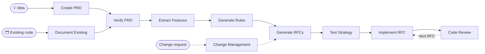

<div align="center">

# 📋 AI PRD Workflow

### RFC-driven development for AI coding agents

**Vague idea → verified PRD → features → rules → sequenced RFCs → reviewed, tested code**

[](https://github.com/nurettincoban/ai-prd-workflow/actions/workflows/ci.yml)
[](LICENSE)
[](CONTRIBUTING.md)
[](https://github.com/nurettincoban/ai-prd-workflow/stargazers)
[](#quick-start)
[](#quick-start)

**[Quick Start](#quick-start)** · **[Workflow](#workflow)** · **[Commands](#available-prompts)** · **[Why RFCs?](#why-rfc-driven-development)** · **[Examples](#examples)**

<sub>RFC-driven since <b>March 2025</b> — before Claude Code or Cursor had a plan mode, and before Kiro or Spec Kit existed.</sub>

</div>

---

A lightweight RFC-driven development workflow for AI coding tools. Eleven prompts take you from a rough idea — or an existing codebase — to a verified PRD, prioritized features, project rules, and sequenced RFCs — then guide implementation, code review, and testing, one RFC at a time.

Use it three ways:

- **Claude Code plugin** — one command, updates with the repo
- **Agent Skills** for Codex, GitHub Copilot, Cursor, Gemini CLI, OpenCode, and Devin — `/create-prd`, `/implement-rfc 001`, `/workflow-status`, …
- **Copy-paste prompts** into any AI assistant — ChatGPT, Claude.ai, anything

No CLI to learn, no framework to adopt, no lock-in. Just markdown.

## Quick Start

### Option 1: Claude Code plugin

Inside Claude Code:

```
/plugin marketplace add nurettincoban/ai-prd-workflow
/plugin install prd-workflow@ai-prd-workflow
```

Plugin skills are namespaced — `/prd-workflow:create-prd`, `/prd-workflow:implement-rfc 001` — and available in every project without touching its files.

### Option 2: Install the skills into a project (any agent)

```bash
curl -fsSL https://raw.githubusercontent.com/nurettincoban/ai-prd-workflow/main/install.sh | bash -s -- /path/to/your/project
```

Or from a clone:

```bash
git clone https://github.com/nurettincoban/ai-prd-workflow.git
cd ai-prd-workflow
./install.sh /path/to/your/project            # .claude/skills/ and .agents/skills/ (default)
./install.sh /path/to/your/project --claude   # Claude Code only
./install.sh /path/to/your/project --agents   # Codex, Copilot, Cursor, Gemini CLI, OpenCode, Devin only
```

`install.sh` never overwrites a skill you have edited — it keeps your copy and tells you, and `--force` replaces it after saving a backup. Pin a release with `--ref v3.0.0` (and the matching tag in the curl URL). Upgrading from v2? Add `--remove-legacy` to move the old command files into a backup folder.

| Tool | Reads | Run a command |
|---|---|---|
| Claude Code | `.claude/skills/`, or the plugin | `/create-prd`, `/implement-rfc 001` |
| GitHub Copilot (VS Code, CLI) | `.agents/skills/` | `/create-prd`, `/implement-rfc 001` |
| Cursor | `.agents/skills/` | `/create-prd` from the `/` menu |
| Gemini CLI | `.agents/skills/` | `/create-prd` |
| OpenCode | `.agents/skills/` | `/create-prd`, `/implement-rfc 001` |
| Devin | `.agents/skills/` | `/create-prd` |
| Codex | `.agents/skills/` | `$create-prd`, or pick it from `/skills` |

> [!IMPORTANT]
> **Restart your AI tool after installing.** A running session does not pick up new skills, so the first command you type fails with `Unknown skill` — which reads like a broken install but is just a stale session. Type `/` after restarting to confirm you see `create-prd`.

Then open your project and work through the pipeline:

```
/create-prd            # guided interview → PRD.md
                       #   …or /document-existing for a codebase that already exists
/verify-prd            # gap analysis → improved PRD.md + PRD-REVIEW.md
/extract-features      # PRD.md → FEATURES.md (MoSCoW prioritized)
/generate-rules        # → RULES.md (project standards for the AI)
/generate-rfcs         # → RFCs/ folder, in dependency order
/test-strategy         # test plan — before the tests get written
/implement-rfc 001     # plan → your approval → implementation → verification
/review-rfc 001        # fresh context → reviews/REVIEW-RFC-001.md
/manage-changes        # requirements changed mid-build? assess impact first
/workflow-status       # lost? see what's done and what's next
```

> [!TIP]
> Want to see what each step produces first? The [url-shortener example](examples/url-shortener/) shows every artifact before and after the workflow.

### Option 3: Copy-paste into any AI assistant

1. Pick a prompt from [Available Prompts](#available-prompts) below
2. Copy its contents (or use `./copy-prompt.sh --list` to browse)
3. Paste into any AI assistant with your project context attached

## Workflow



1. **Create PRD** — Start with a vague idea and develop it into a complete PRD through a guided interview — or, for an existing codebase, **Document Existing** derives the PRD, features and rules from the code
2. **Verify PRD** — Identify critical gaps and improve quality before anything gets built
3. **Extract Features** — Transform the verified PRD into organized features with priorities and acceptance criteria
4. **Generate Rules** — Establish technical guidelines the AI must follow, wired into your agent config (CLAUDE.md, AGENTS.md, or .cursor/rules/)
5. **Generate RFCs** — Break the project into logical, sequenced implementation units
6. **Test Strategy** — Plan coverage from the RFCs' acceptance criteria, while the tests can still be written to the plan rather than the plan written to the tests
7. **Implement RFCs** — One RFC at a time: the AI plans first, you approve, then it codes — and runs the build, typecheck and tests to demonstrate every acceptance criterion rather than asserting it
8. **Code Review** — Review each implementation against its RFC, project rules, security, and performance — in a fresh session, ideally a different model than wrote the code

When requirements change mid-development, run **Change Management** to assess impact before touching the docs, then continue. Run **Workflow Status** anytime to see where you are and what's next.

## Each step is a different lens

Persistent artifacts are the visible half of this workflow. The half that does the work is that **each step looks at the problem through a different lens, and each lens catches defects the others structurally cannot.**

That was measured, not assumed — by running all ten commands end to end to build a real, publishable TypeScript library from a real PRD:

| Step | What it caught | Could another step have caught it? |
|---|---|---|
| `/verify-prd` | A function silently contradicting the PRD's own documented convention; unspecified color space; a hidden rendering dependency | No — required diffing the spec against the reference implementation |
| RFC "edge cases" section | That the pinned TypeScript major would break the build; a clone-aliasing bug; an operation-ordering hazard | No — required reasoning about code that did not exist yet |
| `/review-rfc` | A geometry leak on an error path; unvalidated `NaN` inputs; interleaved buffers read as garbage | No — all 17 acceptance criteria already passed |
| `/test-strategy` | Normals never asserted finite, so degenerate geometry renders black while the entire suite stays green | No — reasons about coverage that *should* exist, not about code that does |
| `/workflow-status` | Two required files never created, while their RFC was reported complete | No — required auditing claims against the filesystem |
| CI matrix from an RFC | The declared peer-dependency range was wrong — the suite failed on three published versions | No — required *running* the suite against each one |
| Cold-context review | An RFC that contradicted itself; an acceptance criterion satisfiable only by luck; a cross-document signature conflict | No — the author had read past all three, repeatedly |

**Seven lenses, seven classes of defect, near-zero overlap.** No single "plan then code" agent mode reproduces that.

The most striking single result: **the workflow predicted a real build failure three steps before the build existed.** `RULES.md` pinned TypeScript 7. The RFC's edge-case section, written before any code, said that if a toolchain plugin lagged TS 7 the fallback was 5.9.x, recorded as a deviation rather than downgraded silently. That is exactly what happened — and `tsc --noEmit` passed clean throughout, so only *running the build* ever revealed it.

### Check it yourself

That library is not part of this repository, so here is evidence you can reproduce:

- **[examples/url-shortener](examples/url-shortener/)** — the v2.0 artifacts, the problems we found in them by hand, and what fresh-context runs found *without seeing that list*: `/workflow-status` 12 of 13, plus six we had missed; `/verify-prd` 10 of 10, plus a server-side request forgery hole hiding in the PRD's own open questions.
- **[evals/](evals/)** — the same checks as a `claude plugin eval` suite that runs each case with and without the workflow, so the difference is measured rather than asserted.

### Cross-referenced artifacts constrain future edits on their own

A prediction going into that run was that re-running `/extract-features` after a PRD change would silently renumber feature IDs and break every RFC citation. It was tested: a cold agent with no session history, no mention of IDs, and two new features deliberately inserted into the *earliest* category — the placement most likely to force renumbering.

**The IDs held completely.** The agent appended the new features at the end and explained itself unprompted: *"all six RFCs cite F1–F39 by number … so the new primitives were appended … numbered so no existing citation moves."*

Nobody wrote that rule down. Because the RFCs cite features by ID and `RULES.md` states a critical path in those terms, a cold reader infers that the IDs are load-bearing. Cross-referenced artifacts don't merely record decisions — they **constrain future edits with no rule written down to enforce it.**

## Available Prompts

| Command | Prompt | Description |
|---------|--------|-------------|
| `/create-prd` | [Interactive PRD Creation](interactive-prd-creation-prompt.md) | Create a PRD through a guided step-by-step questioning process |
| `/document-existing` | [Document Existing Code](document-existing-prompt.md) | Turn an existing codebase into PRD.md, FEATURES.md and RULES.md, so new work is planned against the code as it is |
| `/verify-prd` | [PRD Comprehensive Verification](prd-comprehensive-verification-prompt.md) | Verify and improve your PRD by identifying gaps and quality issues |
| `/extract-features` | [PRD to Features](prd-to-features-prompt.md) | Extract and organize features with MoSCoW prioritization |
| `/generate-rules` | [PRD to Rules](prd-to-rules-prompt.md) | Generate technical guidelines and standards for development |
| `/generate-rfcs` | [PRD to RFCs](prd-to-rfcs-prompt.md) | Break down your PRD into sequenced implementation units |
| `/test-strategy` | [Testing Strategy](testing-strategy-prompt.md) | Generate a comprehensive test plan from features and RFCs |
| `/implement-rfc <id>` | [Implementation Template](implementation-prompt-template.md) | Implement a single RFC — plan first, code after approval, then verify |
| `/review-rfc <id>` | [Code Review](code-review-prompt.md) | Review an implementation against RFC, rules, security, performance |
| `/manage-changes` | [PRD Change Management](prd-change-management-prompt.md) | Assess and integrate requirement changes mid-development |
| `/workflow-status` | [Workflow Status](workflow-status-prompt.md) | See which artifacts exist, detect drift, get the next step |

## Why RFC-driven development?

AI coding agents are strong enough now to build entire features unsupervised — which makes *what you ask for* the bottleneck, not the code. If you've heard of spec-driven development (GitHub Spec Kit, Amazon Kiro), this is the same philosophy — and this workflow predates both — with sequenced RFCs as the unit of work and no framework or CLI to adopt. Structured specs fix the real problems:

- **Clearer instructions, fewer hallucinations** — a PRD and RFCs give the AI precise context and boundaries instead of letting it fill gaps with assumptions
- **Scope control** — explicitly defined in/out of scope prevents the agent from implementing features nobody asked for
- **Incremental verification** — sequenced RFCs let you validate at each step instead of reviewing a 5,000-line diff at the end
- **Context that fits** — focused RFCs work within context limits far better than "here's my whole idea, build it"
- **Traceability & knowledge preservation** — every implementation traces to a requirement, and the docs outlive any one chat session, team member, or model
- **Shared mental model** — business stakeholders, developers, and AI tools all work from the same documents

## "Doesn't my coding agent already plan?"

Yes — tactically. This workflow shipped in March 2025, before Claude Code or Cursor had a plan mode, and it solves a different problem than plan modes do:

| Built-in plan mode | This workflow |
|---|---|
| Plans **one task** — "how do I implement this?" | Plans **the product** — what are we building, for whom, what's out of scope? |
| Plan dies with the session | PRD, features, rules, and RFCs persist across sessions, models, tools, and teammates |
| Takes your request at face value | `/create-prd` interviews you first — decisions leave your head before code exists |
| Reviews code by "looks right" | `/review-rfc` verifies against written acceptance criteria; `/workflow-status` catches drift |

The two compose rather than compete: `/generate-rfcs` decides **what** the next unit of work is, and each `/implement-rfc` hands your agent's planner a well-scoped, context-sized task — exactly what plan mode is good at.

**Sweet spot:** multi-week builds and anyone building something real with AI — where scope creep and forgotten decisions, not code quality, are what kill the project. Starting from a codebase that already exists? `/document-existing` writes the PRD, features and rules from the code as it is, marks what is already built, and the rest of the workflow plans only the new work. For a one-line fix, your agent alone is fine.

## Examples

[examples/url-shortener](examples/url-shortener/) runs one small product through the workflow twice: the artifacts the v2.0 prompts produced, and the same PRD taken through 3.0.0. It lists the problems we found in the v2.0 set by hand, and what fresh-context runs of `/workflow-status` and `/verify-prd` found without seeing that list.

## Compatibility

The prompts are plain markdown and work with any modern LLM:

- **Claude** (Anthropic) — Claude 4 and Claude 5 families
- **GPT** (OpenAI) — GPT-4o, GPT-5 family
- **Gemini** (Google) — Gemini 2.5 and later
- **Open models** — Llama, Mistral, Qwen, DeepSeek (with sufficient context)

Tool support:

- **Plugin**: Claude Code (`/plugin marketplace add nurettincoban/ai-prd-workflow`)
- **Agent Skills** (`SKILL.md`, via `install.sh`): Claude Code, GitHub Copilot, Cursor, Gemini CLI, OpenCode, Devin, Codex — see the table under [Quick Start](#quick-start)
- **Copy-paste**: Cline, Aider, or any chat interface (manually or via `./copy-prompt.sh <prompt-file>`)

## Quick Tips

- Provide complete documents when possible and answer the AI's clarifying questions
- Review and customize AI outputs before implementation — the approval gate in `/implement-rfc` exists for a reason
- Implement RFCs in order; each one is implementable once its declared predecessors are done, so independent branches can run in parallel if you have the people for it
- Run `/review-rfc` in a fresh session, ideally on a different model — a reviewer still holding the author's reasoning is not a reviewer
- When two documents disagree, the order of authority is `PRD.md > FEATURES.md > RULES.md > RFCs > generated plans`, and `RULES.md` beats any generic advice a prompt gives
- Keep RULES.md referenced from your agent config so standards stay in context

## Contributing

See [CONTRIBUTING.md](CONTRIBUTING.md) for guidelines on submitting new prompts, quality standards, and testing approach.

## License

This project is licensed under the MIT License — see the [LICENSE](LICENSE) file for details.

---

<p align="center">Made with care for better product development with AI.<br>If this workflow saves you time, a ⭐ helps others find it.</p>
