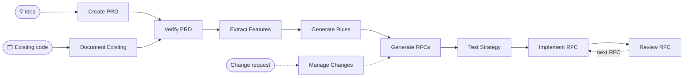

<div align="center">

# 📋 AI PRD Workflow

### RFC-driven development for AI coding agents

**Idea or existing code → verified PRD → features → rules → sequenced RFCs → reviewed, tested code**

[](https://github.com/nurettincoban/ai-prd-workflow/actions/workflows/ci.yml)
[](LICENSE)
[](https://github.com/nurettincoban/ai-prd-workflow/stargazers)
[](#quick-start)
[](#install-options)

**[Quick start](#quick-start)** · **[How it works](#how-it-works)** · **[Why](#why-this-workflow)** · **[Evidence](#evidence)** · **[Install options](#install-options)**

English · [简体中文](README.zh-CN.md) · [Türkçe](README.tr.md)

<sub>RFC-driven since <b>March 2025</b> — before Claude Code or Cursor had a plan mode, and before Kiro or Spec Kit existed.</sub>

</div>

---

AI coding agents write code well. They are worse at deciding what to build, remembering yesterday's decisions, and noticing when two documents disagree. This workflow handles that part. It takes an idea — or a codebase that already exists — to a reviewed PRD, prioritized features, project rules, and small RFCs in dependency order. Then it implements and reviews them one at a time.

Every step writes a markdown file that the next step reads, so decisions outlive the chat session. A script checks that the files still agree with each other. No CLI to learn, no framework to adopt, no lock-in.

<p align="center">
  
</p>
<p align="center"><sub>A real <code>/workflow-status</code> run on the repo's own v2.0 example, condensed. <a href="examples/url-shortener/workflow-status-on-before.md">Full report</a> · <a href="examples/url-shortener/README.md">what it was checked against</a></sub></p>

## Quick start

**Claude Code** — install the plugin:

```
/plugin marketplace add nurettincoban/ai-prd-workflow
/plugin install prd-workflow@ai-prd-workflow
```

**Codex, GitHub Copilot, Cursor, Gemini CLI, OpenCode or Devin** — install the skills into your project:

```bash
curl -fsSL https://raw.githubusercontent.com/nurettincoban/ai-prd-workflow/main/install.sh | bash -s -- /path/to/your/project
```

**Any chat assistant** (ChatGPT, Claude.ai, …) — copy a prompt from the [command table](#how-it-works) and paste it in.

> [!IMPORTANT]
> Restart your AI tool after installing. A running session does not see new skills, so the first command fails with `Unknown skill` — which looks like a broken install but is only a stale session.

Then run the commands in order:

```
/create-prd          # interview → PRD.md   (existing code? use /document-existing instead)
/verify-prd          # gaps and contradictions → improved PRD.md + PRD-REVIEW.md
/extract-features    # → FEATURES.md
/generate-rules      # → RULES.md
/generate-rfcs       # → RFCs/ + RFCS.md, in dependency order
/test-strategy       # → TEST-STRATEGY.md, before any test is written
/implement-rfc 001   # plan → your approval → code → proof that it works
/review-rfc 001      # review in a fresh context → reviews/REVIEW-RFC-001.md
```

Run `/workflow-status` whenever you are unsure what comes next, and `/manage-changes` when requirements change. In Codex, type `$create-prd` instead of `/create-prd`. With the Claude Code plugin, commands carry the plugin's name: `/prd-workflow:create-prd`.

**Try it on the example first.** The repo's v2.0 example looks complete, and it is not:

```bash
git clone https://github.com/nurettincoban/ai-prd-workflow.git
cd ai-prd-workflow
./install.sh examples/url-shortener/before
```

Open `examples/url-shortener/before` in your AI tool, run `/workflow-status`, and compare its report with [the problems we found by hand](examples/url-shortener/README.md).

## How it works



| Command | What it does | Writes | Prompt |
|---|---|---|---|
| `/create-prd` | Interviews you about the idea, a few questions at a time | `PRD.md` | [view](interactive-prd-creation-prompt.md) |
| `/document-existing` | Reads an existing codebase, then asks what the code cannot tell it | `PRD.md`, `FEATURES.md`, `RULES.md` | [view](document-existing-prompt.md) |
| `/verify-prd` | Finds gaps, contradictions, and claims that cannot be built as written | `PRD.md`, `PRD-REVIEW.md` | [view](prd-comprehensive-verification-prompt.md) |
| `/extract-features` | Turns requirements into features with permanent IDs and MoSCoW priorities | `FEATURES.md` | [view](prd-to-features-prompt.md) |
| `/generate-rules` | Sets the standards the agent must follow, with dependency versions checked against the registry | `RULES.md` | [view](prd-to-rules-prompt.md) |
| `/generate-rfcs` | Splits the work into small RFCs in dependency order, then checks each one for gaps with a fresh reader | `RFCs/`, `RFCS.md` | [view](prd-to-rfcs-prompt.md) |
| `/test-strategy` | Plans the tests for each RFC before they are written | `TEST-STRATEGY.md` | [view](testing-strategy-prompt.md) |
| `/implement-rfc <id>` | Plans, waits for your approval, writes the code, then runs the build and tests to prove each criterion | code, RFC status | [view](implementation-prompt-template.md) |
| `/review-rfc <id>` | Reviews the code against the RFC, the rules, and the test plan, in a fresh context | `reviews/` | [view](code-review-prompt.md) |
| `/manage-changes` | Checks a change against past decisions and rules, then updates every affected file together | `changes/` | [view](prd-change-management-prompt.md) |
| `/workflow-status` | Reports what is done, what has drifted, and what to do next | — | [view](workflow-status-prompt.md) |

A few rules hold it together:

- **Plan, approve, then code.** `/implement-rfc` stops after the plan and waits for you.
- **Review with fresh eyes.** `/review-rfc` will not review code written in the same conversation. In Claude Code it runs in a separate context automatically.
- **IDs never change.** Requirements, features, rules, and RFCs cite each other by ID. [`scripts/trace-check.py`](scripts/trace-check.py) fails when a citation breaks or a Must-have feature has no RFC, and the commands run it for you.
- **When files disagree,** `PRD.md` wins over `FEATURES.md`, which wins over `RULES.md`, then the RFCs. The commands say which file they followed, and flag the other for correction.

## Why this workflow

Your coding agent probably has a plan mode. A plan mode plans one task. This workflow plans the product:

| Built-in plan mode | This workflow |
|---|---|
| Plans one task: "how do I build this?" | Plans the product: what are we building, for whom, and what is out of scope? |
| The plan disappears with the session | PRD, features, rules, and RFCs stay — across sessions, models, tools, and teammates |
| Takes your request at face value | Interviews you first, so decisions are written down before any code exists |
| Reviews code by "looks right" | Reviews against written acceptance criteria, and checks the files against each other |

The two work together: `/generate-rfcs` decides what the next piece of work is, and `/implement-rfc` hands your agent's planner a small, well-defined task.

**Use it for** multi-week builds, and anything real you build with AI, where scope creep and forgotten decisions hurt more than code quality. **Skip it for** a one-line fix.

If you know spec-driven development (GitHub Spec Kit, Amazon Kiro), this is the same idea, with RFCs as the unit of work and no CLI or framework to adopt. It predates both.

## Evidence

Each step looks at the project from a different angle, and each catches problems the others cannot. This was measured by building a real TypeScript library end to end with the workflow, from a real PRD:

| Step | What it caught | Why only this step caught it |
|---|---|---|
| `/verify-prd` | A function contradicting the PRD's own convention; an unspecified color space; a hidden rendering dependency | It compared the spec with the reference implementation |
| RFC edge cases | That the pinned TypeScript version would break the build; a clone-aliasing bug | It reasoned about code that did not exist yet |
| `/review-rfc` | A geometry leak on an error path; unvalidated `NaN` inputs | All 17 acceptance criteria had already passed |
| `/test-strategy` | Normals never checked for being finite, so degenerate geometry rendered black while every test passed | It asks which tests should exist, not which do |
| `/workflow-status` | Two required files never created, while their RFC was reported complete | It checked claims against the files on disk |
| CI from an RFC | A wrong peer-dependency range: the tests failed on three published versions | It ran the tests against each version |
| Fresh-reader check | An RFC that contradicted itself; a criterion that could only pass by luck | The author had read past both, repeatedly |

The most striking result: before any code existed, an RFC's edge-case section predicted that a build plugin would not support TypeScript 7 yet, and named the fallback version. That is exactly what happened. Type-checking passed throughout, so only running the build revealed it.

IDs held, too. When the PRD changed mid-project, a fresh agent re-ran `/extract-features` and added the new features at the end instead of renumbering — without being told to, because the RFCs cite features by number.

That library is not part of this repository, so here is evidence you can check yourself:

- **[The url-shortener example](examples/url-shortener/)** — fresh-context runs that never saw our list of known problems found 12 of 13 cross-document problems (`/workflow-status`) and 10 of 10 PRD problems (`/verify-prd`), plus several we had missed.
- **[The eval suite](evals/)** — runs the same checks with and without the workflow, so the difference is measured, not claimed.

## Install options

`install.sh` puts the skills where each tool looks for them:

| Tool | Folder | Run a command |
|---|---|---|
| Claude Code | `.claude/skills/`, or the plugin | `/create-prd` |
| GitHub Copilot (VS Code, CLI) | `.agents/skills/` | `/create-prd` |
| Cursor | `.agents/skills/` | `/create-prd`, from the `/` menu |
| Gemini CLI | `.agents/skills/` | `/create-prd` |
| OpenCode | `.agents/skills/` | `/create-prd` |
| Devin | `.agents/skills/` | `/create-prd` |
| Codex | `.agents/skills/` | `$create-prd`, or pick it from `/skills` |

From a clone of this repository:

```bash
./install.sh /path/to/your/project            # both folders (the default)
./install.sh /path/to/your/project --claude   # Claude Code only
./install.sh /path/to/your/project --agents   # the other tools only
```

- `install.sh` never overwrites a skill you have edited. `--force` replaces it after saving a backup.
- `--ref v3.0.0` installs a specific release. Use the same tag in the curl URL.
- Upgrading from v2? Add `--remove-legacy` to move the old command files into a backup folder.
- Prefer copy-paste? `./copy-prompt.sh --list` shows the prompts, and `./copy-prompt.sh <file>` copies one to your clipboard.

## Tips

- **Answer the questions.** The interview commands work best with your real decisions, not the agent's guesses.
- **Read each file before you move on.** Fixing a PRD takes minutes; fixing code built on a wrong PRD takes days.
- **Keep the rules in context.** Reference `RULES.md` from your agent config (`CLAUDE.md`, `AGENTS.md`, or `.cursor/rules/`). `/generate-rules` suggests how.
- **Parallelize if you can.** An RFC can start as soon as its declared predecessors are done. Working alone, just follow the numbers.

## Contributing

See [CONTRIBUTING.md](CONTRIBUTING.md). The prompt files at the root are the source; everything else is generated or checked from them.

## Acknowledgments

Thank you to [Anthropic](https://www.anthropic.com) for supporting this project and welcoming it into its open source program.

## License

MIT — see [LICENSE](LICENSE).

---

<p align="center">If this workflow saves you time, a ⭐ helps others find it.</p>
