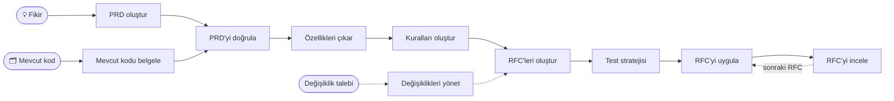

<div align="center">

# 📋 AI PRD Workflow

### AI kodlama ajanları için RFC odaklı geliştirme

**Fikir veya mevcut kod → doğrulanmış PRD → özellikler → kurallar → sıralı RFC'ler → incelenmiş, test edilmiş kod**

[](https://github.com/nurettincoban/ai-prd-workflow/actions/workflows/ci.yml)
[](LICENSE)
[](https://github.com/nurettincoban/ai-prd-workflow/stargazers)
[](#hızlı-başlangıç)
[](#kurulum-seçenekleri)

**[Hızlı başlangıç](#hızlı-başlangıç)** · **[Nasıl çalışır](#nasıl-çalışır)** · **[Neden](#neden-bu-iş-akışı)** · **[Kanıtlar](#kanıtlar)** · **[Kurulum seçenekleri](#kurulum-seçenekleri)**

[English](README.md) · [简体中文](README.zh-CN.md) · Türkçe

<sub><b>Mart 2025</b>'ten beri RFC odaklı — Claude Code ve Cursor'da henüz plan modu yokken, Kiro ve Spec Kit daha ortada yokken.</sub>

</div>

> [!NOTE]
> Bu çeviri İngilizce README'nin gerisinde kalabilir; bir fark varsa [İngilizce sürüm](README.md) geçerlidir.

---

AI kodlama ajanları kod yazmakta iyidir. Ne yapılacağına karar vermekte, dünkü kararları hatırlamakta ve iki dokümanın birbiriyle çeliştiğini fark etmekte o kadar iyi değildirler. Bu iş akışı tam olarak bu kısmı üstlenir: bir fikri — ya da zaten var olan bir kod tabanını — gözden geçirilmiş bir PRD'ye (ürün gereksinimleri dokümanı), önceliklendirilmiş özelliklere, proje kurallarına ve bağımlılık sırasına dizilmiş küçük RFC'lere dönüştürür. Ardından bunları teker teker uygular ve inceler.

Her adım, bir sonraki adımın okuyacağı bir markdown dosyası yazar; böylece kararlar sohbet oturumu kapandığında kaybolmaz. Bir betik de bu dosyaların hâlâ birbiriyle tutarlı olduğunu kontrol eder. Öğrenilecek bir CLI, benimsenecek bir framework, bağımlı kalınacak bir araç yok.

<p align="center">
  
</p>
<p align="center"><sub>Deponun kendi v2.0 örneği üzerinde gerçek bir <code>/workflow-status</code> çalıştırmasının kısaltılmış tekrarı. <a href="examples/url-shortener/workflow-status-on-before.md">Tam rapor</a> · <a href="examples/url-shortener/README.md">neyle karşılaştırıldığı</a></sub></p>

## Hızlı başlangıç

**Claude Code** — eklentiyi kurun:

```
/plugin marketplace add nurettincoban/ai-prd-workflow
/plugin install prd-workflow@ai-prd-workflow
```

**Codex, GitHub Copilot, Cursor, Gemini CLI, OpenCode veya Devin** — skill'leri projenize kurun:

```bash
curl -fsSL https://raw.githubusercontent.com/nurettincoban/ai-prd-workflow/main/install.sh | bash -s -- /path/to/your/project
```

**Herhangi bir sohbet asistanı** (ChatGPT, Claude.ai, …) — [komut tablosundan](#nasıl-çalışır) bir prompt kopyalayıp yapıştırın.

> [!IMPORTANT]
> Kurulumdan sonra AI aracınızı yeniden başlatın. Çalışan bir oturum yeni skill'leri görmez; ilk komut `Unknown skill` hatası verir. Bu, kurulum bozukmuş gibi görünür ama oturum yalnızca eskimiştir.

Ardından komutları sırayla çalıştırın:

```
/create-prd          # mülakat → PRD.md   (kod zaten var mı? bunun yerine /document-existing)
/verify-prd          # boşluklar ve çelişkiler → iyileştirilmiş PRD.md + PRD-REVIEW.md
/extract-features    # → FEATURES.md
/generate-rules      # → RULES.md
/generate-rfcs       # → RFCs/ + RFCS.md, bağımlılık sırasıyla
/test-strategy       # → TEST-STRATEGY.md, daha hiçbir test yazılmadan
/implement-rfc 001   # plan → onayınız → kod → çalıştığının kanıtı
/review-rfc 001      # temiz bir bağlamda inceleme → reviews/REVIEW-RFC-001.md
```

Sıradaki adımdan emin olmadığınızda `/workflow-status`, gereksinimler değiştiğinde `/manage-changes` çalıştırın. Codex'te `/create-prd` yerine `$create-prd` yazın. Claude Code eklentisiyle komutlar eklentinin adını taşır: `/prd-workflow:create-prd`.

**Önce örnek üzerinde deneyin.** Depodaki v2.0 örneği eksiksiz görünüyor, ama değil:

```bash
git clone https://github.com/nurettincoban/ai-prd-workflow.git
cd ai-prd-workflow
./install.sh examples/url-shortener/before
```

`examples/url-shortener/before` klasörünü AI aracınızda açın, `/workflow-status` çalıştırın ve raporunu [elle bulduğumuz problemlerle](examples/url-shortener/README.md) karşılaştırın.

## Nasıl çalışır



| Komut | Ne yapar | Yazdığı | Prompt |
|---|---|---|---|
| `/create-prd` | Fikriniz hakkında, her seferinde birkaç soruyla mülakat yapar | `PRD.md` | [görüntüle](interactive-prd-creation-prompt.md) |
| `/document-existing` | Mevcut bir kod tabanını okur, ardından kodun söyleyemediklerini sorar | `PRD.md`, `FEATURES.md`, `RULES.md` | [görüntüle](document-existing-prompt.md) |
| `/verify-prd` | Boşlukları, çelişkileri ve yazıldığı haliyle hayata geçirilemeyecek gereksinimleri bulur | `PRD.md`, `PRD-REVIEW.md` | [görüntüle](prd-comprehensive-verification-prompt.md) |
| `/extract-features` | Gereksinimleri kalıcı ID'li ve MoSCoW öncelikli özelliklere dönüştürür | `FEATURES.md` | [görüntüle](prd-to-features-prompt.md) |
| `/generate-rules` | Ajanın uyması gereken standartları belirler; bağımlılık sürümlerini paket kayıt sisteminden doğrular | `RULES.md` | [görüntüle](prd-to-rules-prompt.md) |
| `/generate-rfcs` | İşi bağımlılık sırasına göre küçük RFC'lere böler, ardından her birini "taze bir okuyucuya" eksikler için kontrol ettirir | `RFCs/`, `RFCS.md` | [görüntüle](prd-to-rfcs-prompt.md) |
| `/test-strategy` | Testler yazılmadan önce her RFC'nin testlerini planlar | `TEST-STRATEGY.md` | [görüntüle](testing-strategy-prompt.md) |
| `/implement-rfc <id>` | Plan yapar, onayınızı bekler, kodu yazar, sonra her kabul kriterini kanıtlamak için derlemeyi ve testleri çalıştırır | kod, RFC durumu | [görüntüle](implementation-prompt-template.md) |
| `/review-rfc <id>` | Kodu temiz bir bağlamda RFC'ye, kurallara ve test planına göre inceler | `reviews/` | [görüntüle](code-review-prompt.md) |
| `/manage-changes` | Bir değişikliği geçmiş kararlara ve kurallara göre kontrol eder, sonra etkilenen bütün dosyaları birlikte günceller | `changes/` | [görüntüle](prd-change-management-prompt.md) |
| `/workflow-status` | Nelerin bittiğini, nelerin saptığını ve sırada ne olduğunu raporlar | — | [görüntüle](workflow-status-prompt.md) |

İş akışını bir arada tutan birkaç kural:

- **Planla, onayla, sonra kodla.** `/implement-rfc` planı sunduktan sonra durur ve sizi bekler.
- **Taze gözle incele.** `/review-rfc`, aynı sohbette yazılmış kodu incelemez; Claude Code'da otomatik olarak ayrı bir bağlamda çalışır.
- **ID'ler asla değişmez.** Gereksinimler, özellikler, kurallar ve RFC'ler birbirine ID ile atıf yapar. Bir atıf koptuğunda ya da bir Must-have özelliğin RFC'si olmadığında [`scripts/trace-check.py`](scripts/trace-check.py) hata verir; komutlar onu sizin yerinize çalıştırır.
- **Dosyalar çeliştiğinde** `PRD.md`, `FEATURES.md`'nin; o `RULES.md`'nin; o da RFC'lerin önüne geçer. Komutlar hangi dosyayı esas aldığını söyler ve diğerini düzeltilmek üzere işaretler.

## Neden bu iş akışı

Kodlama ajanınızın muhtemelen bir plan modu var. Plan modu tek bir görevi planlar; bu iş akışı ise ürünü planlar:

| Yerleşik plan modu | Bu iş akışı |
|---|---|
| Tek bir görevi planlar: "bunu nasıl yaparım?" | Ürünü planlar: ne yapıyoruz, kimin için ve neler kapsam dışında? |
| Plan, oturumla birlikte kaybolur | PRD, özellikler, kurallar ve RFC'ler kalır — oturumlar, modeller, araçlar ve ekip arkadaşları arasında |
| İsteğinizi olduğu gibi kabul eder | Önce sizinle mülakat yapar; kararlar daha hiç kod yazılmadan kayda geçer |
| Kodu "doğru görünüyor"a göre inceler | Yazılı kabul kriterlerine göre inceler ve dosyaları birbiriyle karşılaştırır |

İkisi birlikte çalışır: `/generate-rfcs` sıradaki işin ne olduğuna karar verir, `/implement-rfc` ise ajanınızın planlayıcısına küçük ve net tanımlanmış bir görev verir.

**Şunlar için kullanın:** haftalar süren projeler ve AI ile ciddi olarak geliştirdiğiniz her şey — kapsam kaymasının ve unutulan kararların kod kalitesinden daha çok zarar verdiği işler. **Şunda gerek yok:** tek satırlık bir düzeltme.

Spesifikasyon odaklı geliştirmeyi (spec-driven development; GitHub Spec Kit, Amazon Kiro) biliyorsanız, bu da aynı fikir: iş birimi olarak RFC'ler var, benimsenecek bir CLI ya da framework yok. Üstelik ikisinden de önce ortaya çıktı.

## Kanıtlar

Her adım projeye farklı bir açıdan bakar ve her biri diğerlerinin yakalayamadığı problemleri yakalar. Bu, gerçek bir PRD'den yola çıkıp iş akışıyla uçtan uca gerçek bir TypeScript kütüphanesi geliştirilerek ölçüldü:

| Adım | Neyi yakaladı | Neden yalnızca bu adım yakaladı |
|---|---|---|
| `/verify-prd` | PRD'nin kendi kuralıyla çelişen bir fonksiyon; belirtilmemiş bir renk uzayı; gizli bir render bağımlılığı | Spesifikasyonu referans uygulamayla karşılaştırdı |
| RFC uç durumları | Sabitlenen TypeScript sürümünün derlemeyi bozacağı; bir klon aliasing hatası | Henüz var olmayan kod üzerine akıl yürüttü |
| `/review-rfc` | Bir hata yolunda geometri sızıntısı; doğrulanmamış `NaN` girdileri | 17 kabul kriterinin hepsi zaten geçmişti |
| `/test-strategy` | Normallerin sonlu olup olmadığı hiç kontrol edilmemişti; dejenere geometri siyah görünüyordu, oysa bütün testler geçiyordu | Hangi testlerin olması gerektiğini sorar, hangilerinin olduğunu değil |
| `/workflow-status` | RFC'si tamamlandı diye raporlanırken hiç oluşturulmamış iki zorunlu dosya | İddiaları diskteki dosyalarla karşılaştırdı |
| Bir RFC'den gelen CI | Yanlış bir peer bağımlılık aralığı: testler yayımlanmış üç sürümde başarısız oldu | Testleri her sürümde ayrı ayrı çalıştırdı |
| Taze okuyucu kontrolü | Kendisiyle çelişen bir RFC; ancak şans eseri geçebilecek bir kabul kriteri | Yazar ikisini de defalarca okuyup gözden kaçırmıştı |

En çarpıcı sonuç: henüz hiç kod yokken bir RFC'nin uç durumlar bölümü, bir derleme eklentisinin TypeScript 7'yi henüz desteklemeyeceğini öngördü ve geri dönülecek sürümü yazdı. Tam olarak bu oldu. Tip denetimi baştan sona geçti; sorunu yalnızca derlemeyi gerçekten çalıştırmak ortaya çıkardı.

ID'ler de korundu. Proje ortasında PRD değiştiğinde, taze bir ajan `/extract-features`'ı yeniden çalıştırdı ve yeni özellikleri yeniden numaralandırmak yerine sona ekledi — kimse ona söylemeden, çünkü RFC'ler özelliklere numarayla atıf yapıyordu.

O kütüphane bu deponun bir parçası değil; bu yüzden kendiniz doğrulayabileceğiniz kanıtlar şunlar:

- **[url-shortener örneği](examples/url-shortener/)** — bilinen problemler listemizi hiç görmeden temiz bir bağlamda çalışan komutlar, dokümanlar arası 13 problemin 12'sini (`/workflow-status`) ve PRD'deki 10 problemin 10'unu (`/verify-prd`) buldu; üstüne bizim kaçırdığımız birkaç problemi de.
- **[Değerlendirme seti](evals/)** — aynı kontrolleri iş akışıyla ve iş akışı olmadan çalıştırır; böylece fark iddia edilmez, ölçülür.

## Kurulum seçenekleri

`install.sh`, skill'leri her aracın aradığı yere koyar:

| Araç | Klasör | Komut çalıştırma |
|---|---|---|
| Claude Code | `.claude/skills/` ya da eklenti | `/create-prd` |
| GitHub Copilot (VS Code, CLI) | `.agents/skills/` | `/create-prd` |
| Cursor | `.agents/skills/` | `/create-prd`, `/` menüsünden |
| Gemini CLI | `.agents/skills/` | `/create-prd` |
| OpenCode | `.agents/skills/` | `/create-prd` |
| Devin | `.agents/skills/` | `/create-prd` |
| Codex | `.agents/skills/` | `$create-prd` ya da `/skills` içinden seçin |

Bu deponun bir klonundan:

```bash
./install.sh /path/to/your/project            # iki klasör de (varsayılan)
./install.sh /path/to/your/project --claude   # yalnızca Claude Code
./install.sh /path/to/your/project --agents   # yalnızca diğer araçlar
```

- `install.sh`, düzenlediğiniz bir skill'in üzerine asla yazmaz; `--force` önce yedek alır, sonra değiştirir.
- `--ref v3.0.0` belirli bir sürümü kurar; curl adresinde de aynı etiketi kullanın.
- v2'den mi yükseltiyorsunuz? Eski komut dosyalarını bir yedek klasörüne taşımak için `--remove-legacy` ekleyin.
- Kopyala-yapıştırı mı tercih ediyorsunuz? `./copy-prompt.sh --list` prompt'ları listeler, `./copy-prompt.sh <dosya>` birini panoya kopyalar.

## Öneriler

- **Soruları yanıtlayın.** Mülakat yapan komutlar, ajanın tahminleriyle değil, sizin gerçek kararlarınızla en iyi sonucu verir.
- **İlerlemeden önce her dosyayı okuyun.** Bir PRD'yi düzeltmek dakikalar sürer; yanlış bir PRD üzerine yazılmış kodu düzeltmek günler sürer.
- **Kuralları bağlamda tutun.** Ajan yapılandırmanızdan (`CLAUDE.md`, `AGENTS.md` veya `.cursor/rules/`) `RULES.md`'ye atıf yapın; `/generate-rules` bunun nasıl yapılacağını önerir.
- **Mümkünse paralel çalışın.** Bir RFC, beyan edilen öncülleri biter bitmez başlayabilir. Tek başınıza çalışıyorsanız numaraları takip etmeniz yeterli.

## Katkıda bulunma

[CONTRIBUTING.md](CONTRIBUTING.md) dosyasına bakın. Kök dizindeki prompt dosyaları kaynaktır; geri kalan her şey onlardan üretilir ya da onlara göre kontrol edilir.

## Teşekkürler

Bu projeyi desteklediği ve açık kaynak programına kabul ettiği için [Anthropic](https://www.anthropic.com)'e teşekkür ederiz.

## Lisans

MIT — [LICENSE](LICENSE) dosyasına bakın.

---

<p align="center">Bu iş akışı size zaman kazandırıyorsa, bir ⭐ başkalarının da onu bulmasına yardımcı olur.</p>
