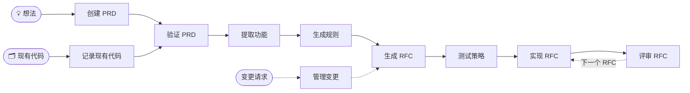

<div align="center">

# 📋 AI PRD Workflow

### 面向 AI 编程代理的 RFC 驱动开发

**想法或现有代码 → 经过验证的 PRD → 功能 → 规则 → 有序的 RFC → 经过评审和测试的代码**

[](https://github.com/nurettincoban/ai-prd-workflow/actions/workflows/ci.yml)
[](LICENSE)
[](https://github.com/nurettincoban/ai-prd-workflow/stargazers)
[](#快速开始)
[](#安装选项)

**[快速开始](#快速开始)** · **[工作原理](#工作原理)** · **[为什么](#为什么选择这个工作流)** · **[实证](#实证)** · **[安装选项](#安装选项)**

[English](README.md) · 简体中文 · [Türkçe](README.tr.md) · [日本語](README.ja.md) · [한국어](README.ko.md) · [Español](README.es.md)

<sub>自 <b>2025 年 3 月</b>起采用 RFC 驱动 —— 早于 Claude Code 和 Cursor 推出计划模式（plan mode），也早于 Kiro 和 Spec Kit 的出现。</sub>

</div>

> [!NOTE]
> 本译文可能落后于英文版 README；如有出入，以[英文版](README.md)为准。

---

AI 编程代理很擅长写代码，却不太擅长决定该做什么、记住昨天做过的决定，以及发现两份文档之间的矛盾。这个工作流负责的正是这一部分：它把一个想法（或一个已经存在的代码库）变成经过评审的 PRD（产品需求文档）、带优先级的功能清单、项目规则，以及按依赖顺序排列的小型 RFC，然后逐个实现并评审。

每一步都会写出一个 markdown 文件，供下一步读取，因此决策不会随着聊天会话结束而丢失；还有一个脚本会检查这些文件之间是否仍然一致。无需学习 CLI，无需引入框架，没有厂商锁定。

<p align="center">
  
</p>
<p align="center"><sub>对本仓库自带的 v2.0 示例真实运行 <code>/workflow-status</code> 的精简回放。<a href="examples/url-shortener/workflow-status-on-before.md">完整报告</a> · <a href="examples/url-shortener/README.md">对照的问题清单</a></sub></p>

## 快速开始

**Claude Code**：安装插件。

```
/plugin marketplace add nurettincoban/ai-prd-workflow
/plugin install prd-workflow@ai-prd-workflow
```

**Codex、GitHub Copilot、Cursor、Gemini CLI、OpenCode 或 Devin**：把技能（skills）安装到你的项目中。

```bash
curl -fsSL https://raw.githubusercontent.com/nurettincoban/ai-prd-workflow/main/install.sh | bash -s -- /path/to/your/project
```

**任意聊天助手**（ChatGPT、Claude.ai 等）：从[命令表](#工作原理)中复制一个提示词，粘贴进去即可。

> [!IMPORTANT]
> 安装后请重启你的 AI 工具。正在运行的会话看不到新安装的技能，第一个命令会报 `Unknown skill`——看起来像是安装失败，其实只是会话过期了。

然后按顺序运行这些命令：

```
/create-prd          # 访谈 → PRD.md（已有代码？改用 /document-existing）
/verify-prd          # 找出缺口和矛盾 → 改进后的 PRD.md + PRD-REVIEW.md
/extract-features    # → FEATURES.md
/generate-rules      # → RULES.md
/generate-rfcs       # → RFCs/ + RFCS.md，按依赖顺序排列
/test-strategy       # → TEST-STRATEGY.md，在编写任何测试之前
/implement-rfc 001   # 计划 → 你批准 → 编码 → 证明它能工作
/review-rfc 001      # 在全新上下文中评审 → reviews/REVIEW-RFC-001.md
```

不确定下一步做什么时，运行 `/workflow-status`；需求变更时，运行 `/manage-changes`。在 Codex 中，用 `$create-prd` 代替 `/create-prd`。使用 Claude Code 插件时，命令带有插件名前缀：`/prd-workflow:create-prd`。

**先在示例上试试。** 仓库自带的 v2.0 示例看起来很完整，其实并不：

```bash
git clone https://github.com/nurettincoban/ai-prd-workflow.git
cd ai-prd-workflow
./install.sh examples/url-shortener/before
```

在你的 AI 工具中打开 `examples/url-shortener/before`，运行 `/workflow-status`，再把它的报告和[我们人工找到的问题](examples/url-shortener/README.md)对比一下。

## 工作原理



| 命令 | 作用 | 写入 | 提示词 |
|---|---|---|---|
| `/create-prd` | 就你的想法进行访谈，每次只问几个问题 | `PRD.md` | [查看](interactive-prd-creation-prompt.md) |
| `/document-existing` | 阅读现有代码库，再询问代码本身无法回答的问题 | `PRD.md`、`FEATURES.md`、`RULES.md` | [查看](document-existing-prompt.md) |
| `/verify-prd` | 找出缺口、矛盾，以及按原文无法实现的要求 | `PRD.md`、`PRD-REVIEW.md` | [查看](prd-comprehensive-verification-prompt.md) |
| `/extract-features` | 把需求整理成带永久 ID 和 MoSCoW 优先级的功能 | `FEATURES.md` | [查看](prd-to-features-prompt.md) |
| `/generate-rules` | 制定代理必须遵守的规范，依赖版本均对照包注册表核实 | `RULES.md` | [查看](prd-to-rules-prompt.md) |
| `/generate-rfcs` | 把工作拆成按依赖排序的小型 RFC，并让一位"全新读者"逐个检查缺口 | `RFCs/`、`RFCS.md` | [查看](prd-to-rfcs-prompt.md) |
| `/test-strategy` | 在编写测试之前，为每个 RFC 规划测试 | `TEST-STRATEGY.md` | [查看](testing-strategy-prompt.md) |
| `/implement-rfc <id>` | 先做计划并等待你批准，再写代码，然后运行构建和测试，逐条证明验收标准 | 代码、RFC 状态 | [查看](implementation-prompt-template.md) |
| `/review-rfc <id>` | 在全新上下文中，对照 RFC、规则和测试计划评审代码 | `reviews/` | [查看](code-review-prompt.md) |
| `/manage-changes` | 对照过去的决策和规则检查一项变更，再同步更新所有受影响的文件 | `changes/` | [查看](prd-change-management-prompt.md) |
| `/workflow-status` | 报告哪些已完成、哪些已偏离，以及下一步做什么 | — | [查看](workflow-status-prompt.md) |

支撑这个工作流的几条规则：

- **先计划，再批准，最后编码。** `/implement-rfc` 给出计划后会停下来等你。
- **用新的眼光评审。** `/review-rfc` 不会评审在同一个对话中写出的代码；在 Claude Code 中，它会自动在独立的上下文里运行。
- **ID 永不改变。** 需求、功能、规则和 RFC 通过 ID 互相引用。一旦引用断开，或某个 Must-have 功能没有对应的 RFC，[`scripts/trace-check.py`](scripts/trace-check.py) 就会报错——各个命令会替你运行它。
- **文件之间有冲突时，** `PRD.md` 优先于 `FEATURES.md`，其次是 `RULES.md`，最后是 RFC。命令会说明遵循了哪个文件，并标记另一个文件待修正。

## 为什么选择这个工作流

你的编程代理很可能已经有计划模式（plan mode）。计划模式规划的是单个任务，而这个工作流规划的是整个产品：

| 内置计划模式 | 这个工作流 |
|---|---|
| 规划一个任务："这个怎么实现？" | 规划产品：我们在做什么、为谁做、哪些不在范围内？ |
| 计划随会话结束而消失 | PRD、功能、规则和 RFC 一直保留——跨会话、跨模型、跨工具、跨团队成员 |
| 按字面接受你的请求 | 先对你进行访谈，让决策在任何代码出现之前就写下来 |
| 凭"看起来没问题"评审代码 | 对照书面验收标准评审，并交叉检查各个文件 |

两者可以配合使用：`/generate-rfcs` 决定下一块工作是什么，`/implement-rfc` 再把一个小而明确的任务交给代理的计划器。

**适合**：持续数周的项目，以及任何你用 AI 认真构建的东西——在这些场景里，范围蔓延和被遗忘的决策比代码质量更伤人。**不适合**：一行代码的修复。

如果你了解规范驱动开发（spec-driven development，例如 GitHub Spec Kit、Amazon Kiro），这里是同样的理念：以 RFC 为工作单元，不需要引入任何 CLI 或框架。而且它比这两者都更早出现。

## 实证

每一步都从不同的角度审视项目，每一步都能发现其他步骤发现不了的问题。这是在用该工作流、基于一份真实的 PRD，从头到尾构建一个真实的 TypeScript 库时实际测得的：

| 步骤 | 发现了什么 | 为什么只有这一步能发现 |
|---|---|---|
| `/verify-prd` | 一个函数违背了 PRD 自己定义的约定；未指定的颜色空间；一个隐藏的渲染依赖 | 它把规范和参考实现做了比对 |
| RFC 的边界情况 | 锁定的 TypeScript 版本会让构建失败；一个克隆别名（aliasing）bug | 它在推理尚不存在的代码 |
| `/review-rfc` | 错误路径上的几何体泄漏；未校验的 `NaN` 输入 | 当时 17 条验收标准已经全部通过 |
| `/test-strategy` | 从未检查法线是否为有限值，于是退化几何体渲染成黑色，而所有测试都通过了 | 它问的是"应该有哪些测试"，而不是"现在有哪些测试" |
| `/workflow-status` | 两个必需的文件从未创建，而对应的 RFC 却被报告为已完成 | 它把声明和磁盘上的文件逐一核对 |
| 来自 RFC 的 CI | peer 依赖的版本范围写错了：测试在三个已发布版本上失败 | 它在每个版本上都实际运行了测试 |
| 全新读者检查 | 一个自相矛盾的 RFC；一条只能靠运气才能通过的验收标准 | 作者自己反复读过，却都没看出来 |

最惊人的一个结果：在任何代码出现之前，某个 RFC 的边界情况一节就预测到一个构建插件还不支持 TypeScript 7，并写明了回退版本。后来果然如此。类型检查一直是通过的，只有真正运行构建才暴露了这个问题。

ID 也守住了。项目进行到一半 PRD 发生变化时，一个全新的代理重新运行了 `/extract-features`，把新功能追加到末尾而不是重新编号——没有人告诉它这样做，原因是各个 RFC 都按编号引用功能。

那个库不在本仓库中，所以这里提供你可以亲自验证的证据：

- **[url-shortener 示例](examples/url-shortener/)**：在全新上下文中运行、从未看过我们问题清单的命令，找出了 13 个跨文档问题中的 12 个（`/workflow-status`）和 10 个 PRD 问题中的全部 10 个（`/verify-prd`），还发现了好几个我们漏掉的问题。
- **[评测套件](evals/)**：在启用和不启用该工作流的两种情况下运行同样的检查，用测量结果说明差异，而不是空口断言。

## 安装选项

`install.sh` 会把技能放到各个工具查找它们的位置：

| 工具 | 目录 | 运行命令 |
|---|---|---|
| Claude Code | `.claude/skills/`，或插件 | `/create-prd` |
| GitHub Copilot（VS Code、CLI） | `.agents/skills/` | `/create-prd` |
| Cursor | `.agents/skills/` | `/create-prd`，从 `/` 菜单中选择 |
| Gemini CLI | `.agents/skills/` | `/create-prd` |
| OpenCode | `.agents/skills/` | `/create-prd` |
| Devin | `.agents/skills/` | `/create-prd` |
| Codex | `.agents/skills/` | `$create-prd`，或从 `/skills` 中选择 |

在本仓库的克隆中：

```bash
./install.sh /path/to/your/project            # 两个目录都安装（默认）
./install.sh /path/to/your/project --claude   # 仅 Claude Code
./install.sh /path/to/your/project --agents   # 仅其他工具
```

- `install.sh` 永远不会覆盖你修改过的技能；`--force` 会先保存备份再替换。
- `--ref v3.0.0` 安装指定版本，curl 的 URL 中也请使用同一个标签。
- 从 v2 升级？加上 `--remove-legacy`，旧的命令文件会被移到备份目录。
- 更喜欢复制粘贴？`./copy-prompt.sh --list` 列出所有提示词，`./copy-prompt.sh <file>` 把其中一个复制到剪贴板。

## 使用技巧

- **认真回答问题。** 访谈类命令最适合用你真实的决定，而不是代理的猜测。
- **进入下一步之前先读一遍文件。** 修改 PRD 只要几分钟；修改基于错误 PRD 写出的代码要花好几天。
- **让规则留在上下文中。** 在代理的配置文件（`CLAUDE.md`、`AGENTS.md` 或 `.cursor/rules/`）中引用 `RULES.md`，`/generate-rules` 会建议具体做法。
- **能并行就并行。** 一个 RFC 只要其声明的前置 RFC 完成就可以开始；一个人开发时，按编号顺序进行即可。

## 参与贡献

请参阅 [CONTRIBUTING.md](CONTRIBUTING.md)。根目录下的提示词文件是唯一来源，其他内容都由它们生成或据此检查。

## 致谢

感谢 [Anthropic](https://www.anthropic.com) 对本项目的支持，并将其纳入开源计划。

## 许可证

MIT —— 参见 [LICENSE](LICENSE)。

---

<p align="center">如果这个工作流帮你节省了时间，点个 ⭐ 能让更多人发现它。</p>
